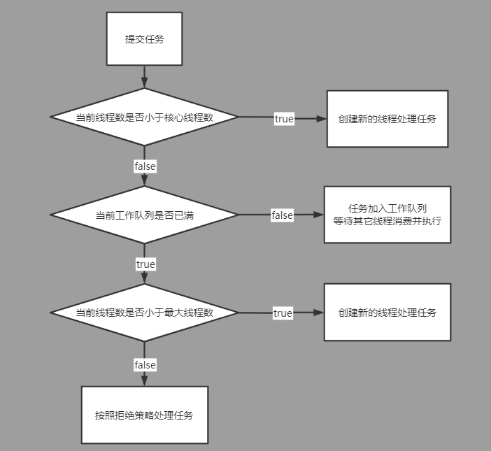

# jdk线程池工作原理解析(一)
## 线程池介绍
在日常开发中经常会遇到使用其它线程将大量任务异步处理的场景（异步化以及提升系统的吞吐量），但在使用线程时存在着两个痛点。
1. 在java等很多主流语言中每个逻辑上的线程底层都对应着一个系统线程（不考虑虚拟线程的情况）。操作系统创建一个新线程是存在一定开销的，
   在需要执行**大量的**异步任务时，如果处理每个任务时都直接向系统申请创建一个线程来执行，并在任务执行完毕后再回收线程，则创建/销毁大量线程的开销将无法忍受。
2. 每个系统线程都会占用一定的内存空间，且系统在调度不同线程上下文切换时存在一定的cpu开销。因此在一定的硬件条件下，操作系统能同时维护的系统线程个数是比较有限的。
   在使用线程的过程中如果没有控制好流量，会很容易创建过多的线程而耗尽系统资源，令系统变得不可用。

而线程池正是为解决上述痛点而生的，其通过两个手段来解决上述痛点。
### 池化线程资源
池化线程资源，顾名思义就是维护一个存活线程的集合（池子）。提交任务的用户程序不直接控制线程的创建和销毁，不用每次执行任务时都申请创建一个新线程，而是通过线程池间接的获得线程去处理异步任务。
线程池中的线程在执行完任务后通常也不会被系统回收掉，而是继续待在池子中用于执行其它的任务（执行堆积的待执行任务或是等待新任务）。  
**线程池通过池化线程资源，避免了系统反复创建/销毁线程的开销，大幅提高了处理大规模异步任务时的性能。**
### 对线程资源的申请进行收口，限制系统资源的使用
如果程序都统一使用线程池来处理异步任务，那么线程池内部便可以对系统资源的使用施加一定限制。
例如用户可以指定一个线程池最大可维护的线程数量，避免耗尽系统资源。
当用户提交任务的速率过大，导致线程池中的线程数到达指定的最大值时依然无法满足需求时，线程池可以通过丢弃部分任务或限制提交任务的流量的方式来处理这一问题。  
**线程池通过对线程资源的使用进行统一收口，用户可以通过线程池的参数限制系统资源的使用，从而避免系统资源耗尽。**

## jdk线程池ThreadPoolExecutor简单介绍
前面介绍了线程池的概念，而要深入理解线程池的工作原理最好的办法便是找到一个优秀的线程池实现来加以研究。  
而自jdk1.5中引入的通用线程池框架ThreadPoolExecutor便是一个很好的学习对象。其内部实现不算复杂，却在高效实现核心功能的同时还提供了较丰富的拓展能力。
#####
下面从整体上介绍一下jdk通用线程池ThreadPoolExecutor的工作原理（基于jdk8）。
### ThreadPoolExecutor运行时工作流程
首先ThreadPoolExecutor允许用户从两个不同维度来控制线程资源的使用，即最大核心线程数(corePoolSize)和最大线程数(maximumPoolSize)。
最大核心线程数：核心线程指的是**通常**常驻线程池的线程。常驻线程在线程池没有任务空闲时也不会被销毁，而是处于idle状态，这样在新任务到来时就能很快的进行响应。
最大线程数：和第一节中提到的一样，即线程池中所能允许的活跃线程的最大数量。
#####
在向ThreadPoolExecutor提交任务时（execute方法），会执行一系列的判断来决定任务应该如何被执行（源码在下一节中具体分析）。
1. 首先判断当前活跃的线程数是否小于指定的**最大核心线程数corePoolSize**。  
   如果为真，则说明当前线程池还未完成预热，核心线程数不饱和，创建一个新线程来执行该任务。  
   如果为假，则说明当前线程池已完成预热，进行下一步判断。
2. 尝试将当前任务放入**工作队列workQueue**（阻塞队列BlockingQueue类型），工作队列中的任务会被线程池中的活跃线程按入队顺序逐个消费。  
   如果入队成功，则说明当前工作队列未满，入队的任务将会被线程池中的某个活跃线程所消费并执行。  
   如果入队失败，则说明当前工作队列已饱和，线程池消费任务的速度可能太慢了，可能需要创建更多新线程来加速消费，进行下一步判断。
3. 判断当前活跃的线程数是否小于指定的**最大线程数maximumPoolSize**。  
   如果为真，则说明当前线程池所承载的线程数还未达到参数指定的上限，还有余量来创建新的线程加速消费，创建一个新线程来执行该任务。  
   如果为假，则说明当前线程池所承载的线程数达到了上限，但处理任务的速度依然不够快，需要触发**拒绝策略**。  

### ThreadPoolExecutor优雅停止
线程池的优雅停止一般要能做到以下几点：
1. 线程池在中止后不能再受理新的任务
2. 线程池中止的过程中，已经提交的现存任务不能丢失（等待剩余任务执行完再关闭或者能够把剩余的任务吐出来还给用户）
3. 线程池最终关闭前，确保创建的所有工作线程都已退出，不会出现资源的泄露
#####
线程池自启动后便会有大量的工作线程在内部持续不断并发的执行提交的各种任务，而要想做到优雅停止并不是一件容易的事情。
因此ThreadPoolExecutor中最复杂的部分并不在于上文中的正常工作流程，而在于分散在各个地方但又紧密协作的，控制优雅停止的逻辑。
### ThreadPoolExecutor的其它功能
除了正常的工作流程以及优雅停止的功能外，ThreadPoolExecutor还提供了一些比较好用的功能
1. 提供了很多protected的钩子函数方便用户继承后进行各种拓展
2. 在运行时统计了总共执行的任务数等关键指标，并提供了对应的api便于用户在运行时观察运行状态
3. 允许在线程池运行过程中动态修改关键的配置参数（比如corePoolSize等），并实时的生效。

## jdk线程池ThreadPoolExecutor源码解析(自己动手实现线程池v1版本)
如费曼所说：What I can not create I do not understand（我不能理解我创造不了的东西）。
通过模仿jdk的ThreadPoolExecutor实现，从零开始实现一个线程池，可以迫使自己去仔细的捋清楚jdk线程池中设计的各种细节，加深理解以达到更好的学习效果。
#####
前面提到ThreadPoolExecutor的核心逻辑主要分为两部分，一是正常运行时处理提交的任务的逻辑，二是实现优雅停止的逻辑。
因此我们实现的线程池MyThreadPoolExecutor（以My开头用于区分）也会分为两个版本，v1版本只实现前一部分即正常运行时执行任务的逻辑，将有关线程池优雅停止的逻辑全部去除。
相比直接啃jdk最终实现的源码，v1版本的实现会更简单更易理解，让正常执行任务时的逻辑更加清洗而不会耦合太多优雅停止的逻辑。

### 线程池关键成员变量介绍
ThreadPoolExecutor中有许多的成员变量，大致可以分为三类。
#### 可由用户自定义的、用于控制线程池运行的配置参数
1. volatile int corePoolSize（最大核心线程数量）
2. volatile int maximumPoolSize（最大线程数量）
3. volatile long keepAliveTime（idle线程保活时间）
4. final BlockingQueue workQueue（工作队列（阻塞队列））
5. volatile ThreadFactory threadFactory（工作线程工厂）
6. volatile RejectedExecutionHandler handler（拒绝异常处理器）
7. volatile boolean allowCoreThreadTimeOut（是否允许核心线程在idle超时后退出）
#####
其中前6个配置参数都可以在ThreadPoolExecutor的构造函数中指定，而allowCoreThreadTimeOut则可以通过暴露的public方法allowCoreThreadTimeOut来动态的设置。  
而且其中大部分属性都是volatile修饰的，目的是让运行过程中可以用过提供的public方法动态修改这些值后，线程池中的活跃的工作线程或者提交任务的用户线程能及时的感知到变化（线程间的可见性），并进行响应（比如令核心线程自动的idle退出）  
这些配置属性具体如何控制线程池行为的原理都会在下面的源码解析中展开介绍。理解这些参数的工作原理后才能在实际的业务中使用线程池时为其设置合理的值。
#### 仅供线程池内部工作时使用的属性
1. ReentrantLock mainLock（用于控制各种临界区逻辑的并发）
2. HashSet<Worker> workers（当前活跃工作线程Worker的集合，工作线程的工作原理会在下文介绍）
3. AtomicInteger ctl（线程池控制状态，control的简写）
#####
这里重点介绍一下ctl属性。ctl虽然是一个32位的整型字段（AtomicInteger），但实际上却用于标识两个业务属性，即当前线程池的运行状态和worker线程的总数量。  
在线程池初始化时状态位RUNNING，worker线程数量位0（private final AtomicInteger ctl = new AtomicInteger(ctlOf(RUNNING, 0));）。  
ctl的32位中的高3位用于标识线程池当前的状态，剩余的29位用于标识线程池中worker线程的数量（因此理论上ThreadPoolExecutor最大可容纳的线程数并不是2^31-1(32位中符号要占一位)，而是2^29-1）  
由于聚合之后单独的读写某一个属性不是很方便，所以ThreadPoolExecutor中提供了很多基于位运算的辅助函数来简化这些逻辑。  
#####
**ctl这样聚合的设计比起拆分成两个独立的字段有什么好处？**  
在ThreadPoolExecutor中关于优雅停止的逻辑中有很多地方是需要**同时判断**当前工作线程数量与线程池状态后，再对线程池状态工作线程数量进行更新的（具体逻辑在下一篇v2版本的博客中展开）。  
且为了执行效率，不使用互斥锁而是通过cas重试的方法来解决并发更新的问题。而对一个AtomicInteger属性做cas重试的更新，要比同时控制两个属性进行cas的更新要简单很多，执行效率也高很多。
#####
ThreadPoolExecutor共有五种状态，但有四种都和优雅停止有关（除了RUNNING）。
但由于v1版本的MyThreadPoolExecutorV1不支持优雅停止，所以不在本篇博客中讲解这些状态具体的含义以及其是如何变化的（下一篇v2版本的博客中展开）

#### 记录线程池运行过程中的一些关键指标
1. completedTaskCount（线程池自启动后已完成的总任务数）
2. largestPoolSize（线程池自启动后工作线程个数的最大值）
在运行过程中，ThreadPoolExecutor会在对应的地方进行埋点，统计一些指标并提供相应的api给用户实时的查询，以提高线程池工作时的可观测性。
#####
```java
public class MyThreadPoolExecutorV1 implements MyThreadPoolExecutor{
    
   /**
    * 指定的最大核心线程数量
    * */
   private volatile int corePoolSize;

   /**
    * 指定的最大线程数量
    * */
   private volatile int maximumPoolSize;

   /**
    * 线程保活时间(单位：纳秒 nanos)
    * */
   private volatile long keepAliveTime;

   /**
    * 存放任务的工作队列(阻塞队列)
    * */
   private final BlockingQueue<Runnable> workQueue;

   /**
    * 线程工厂
    * */
   private volatile ThreadFactory threadFactory;

   /**
    * 拒绝策略
    * */
   private volatile MyRejectedExecutionHandler handler;

   /**
    * 是否允许核心线程在idle一定时间后被销毁（和非核心线程一样）
    * */
   private volatile boolean allowCoreThreadTimeOut;

   /**
    * 主控锁
    * */
   private final ReentrantLock mainLock = new ReentrantLock();

   /**
    * 当前线程池已完成的任务数量
    * */
   private long completedTaskCount;

   /**
    * 维护当前存活的worker线程集合
    * */
   private final HashSet<MyWorker> workers = new HashSet<>();

   /**
    * 当前线程池中存在的worker线程数量 + 状态的一个聚合（通过一个原子int进行cas，来避免对两个业务属性字段加锁来保证一致性）
    * v1版本只关心前者，即worker线程数量
    */
   private final AtomicInteger ctl = new AtomicInteger(ctlOf(RUNNING, 0));
   private static final int COUNT_BITS = Integer.SIZE - 3;

   /**
    * 32位的有符号整数，有3位是用来存放线程池状态的，所以用来维护当前工作线程个数的部分就只能用29位了
    * 被占去的3位中，有1位原来的符号位，2位是原来的数值位。
    * */
   private static final int CAPACITY   = (1 << COUNT_BITS) - 1;

   /**
    * 线程池状态poolStatus常量（状态值只会由小到大，单调递增）
    * 线程池状态迁移图：
    *         ↗ SHUTDOWN ↘
    * RUNNING       ↓       TIDYING → TERMINATED
    *         ↘   STOP   ↗
    * 1 RUNNING状态，代表着线程池处于正常运行的状态。能正常的接收并处理提交的任务
    * 线程池对象初始化时，状态为RUNNING
    * 对应逻辑：private final AtomicInteger ctl = new AtomicInteger(ctlOf(RUNNING, 0));
    *
    * 2 SHUTDOWN状态，代表线程池处于停止对外服务的状态。不再接收新提交的任务，但依然会将workQueue工作队列中积压的任务处理完
    * 调用了shutdown方法时，状态由RUNNING -> SHUTDOWN
    * 对应逻辑：shutdown方法中的advanceRunState(SHUTDOWN);
    *
    * 3 STOP状态，代表线程池处于停止状态。不再接受新提交的任务，同时也不再处理workQueue工作队列中积压的任务，当前还在处理任务的工作线程将收到interrupt中断通知
    * 之前未调用shutdown方法，直接调用了shutdownNow方法，状态由RUNNING -> STOP
    * 之前先调用了shutdown方法，后调用了shutdownNow方法，状态由SHUTDOWN -> STOP
    * 对应逻辑：shutdownNow方法中的advanceRunState(STOP);
    *
    * 4 TIDYING状态，代表着线程池即将完全终止，正在做最后的收尾工作
    * 当前线程池状态为SHUTDOWN,任务被消费完工作队列workQueue为空，且工作线程全部退出完成工作线程集合workers为空时，tryTerminate方法中将状态由SHUTDOWN->TIDYING
    * 当前线程池状态为STOP,工作线程全部退出完成工作线程集合workers为空时，tryTerminate方法中将状态由STOP->TIDYING
    * 对应逻辑：tryTerminate方法中的ctl.compareAndSet(c, ctlOf(TIDYING, 0)
    *
    * 5 TERMINATED状态，代表着线程池完全的关闭。之前线程池已经处于TIDYING状态，且调用的钩子函数terminated已返回
    * 当前线程池状态为TIDYING，调用的钩子函数terminated已返回
    * 对应逻辑：tryTerminate方法中的ctl.set(ctlOf(TERMINATED, 0));
    * */
   private static final int RUNNING = -1 << COUNT_BITS;
   private static final int SHUTDOWN = 0 << COUNT_BITS;
   private static final int STOP = 1 << COUNT_BITS;
   private static final int TIDYING = 2 << COUNT_BITS;
   private static final int TERMINATED = 3 << COUNT_BITS;

   // Packing and unpacking ctl
   private static int workerCountOf(int c)  { return c & CAPACITY; }
   private static int ctlOf(int rs, int wc) { return rs | wc; }

   /**
    * 跟踪线程池曾经有过的最大线程数量（只能在mainLock的并发保护下更新）
    */
   private int largestPoolSize;

   private boolean compareAndIncrementWorkerCount(int expect) {
      return this.ctl.compareAndSet(expect, expect + 1);
   }
   private boolean compareAndDecrementWorkerCount(int expect) {
      return ctl.compareAndSet(expect, expect - 1);
   }

   private void decrementWorkerCount() {
      do {
         // cas更新，workerCount自减1
      } while (!compareAndDecrementWorkerCount(ctl.get()));
   }

   public MyThreadPoolExecutorV1(int corePoolSize,
                                 int maximumPoolSize,
                                 long keepAliveTime,
                                 TimeUnit unit,
                                 BlockingQueue<Runnable> workQueue,
                                 ThreadFactory threadFactory,
                                 MyRejectedExecutionHandler handler) {
      // 基本的参数校验
      if (corePoolSize < 0 || maximumPoolSize <= 0 || maximumPoolSize < corePoolSize || keepAliveTime < 0) {
         throw new IllegalArgumentException();
      }

      if (unit == null || workQueue == null || threadFactory == null || handler == null) {
         throw new NullPointerException();
      }

      // 设置成员变量
      this.corePoolSize = corePoolSize;
      this.maximumPoolSize = maximumPoolSize;
      this.workQueue = workQueue;
      this.keepAliveTime = unit.toNanos(keepAliveTime);
      this.threadFactory = threadFactory;
      this.handler = handler;
   }

   public ThreadFactory getThreadFactory() {
      return threadFactory;
   }
}
```
#### Worker工作线程
ThreadPoolExecutor中的工作线程并不是裸的Thread,而是被封装在了一个Worker的内部类中。  
Worker实现了Runnable所以可以作为一个普通的线程来启动，在run方法中只是简单的调用了一下runWorker(runWorker后面再展开)。  
Worker类有三个成员属性：
1. Thread thread（被封装的工作线程对象）
2. Runnable firstTask（提交任务时，创建新Worker对象时指定的第一次要执行的任务（后续线程就会去拉取工作队列里的任务执行了））
3. volatile long completedTasks（统计用，计算当前工作线程总共完成了多少个任务）
#####
Worker内封装的实际的工作线程对象thread，其在构造函数中由线程池的线程工厂threadFactory生成，传入this，所以thread在start后，便会调用run方法进而执行runWorker。
线程工厂可以由用户在创建线程池时通过参数指定，因此用户在自由控制所生成的工作线程的同时，也需要保证newThread能正确的返回一个可用的线程对象。
#####
除此之外，Worker对象还继承了AbstractQueuedSynchronizer（AQS）类，简单的实现了一个不可重入的互斥锁。  
对AQS互斥模式不太了解的读者可以参考一下我之前关于AQS互斥模式的博客：https://www.cnblogs.com/xiaoxiongcanguan/p/15158618.html  
AQS中维护了一个int类型的state成员变量，其具体的含义由使用者自己赋予。
在Worker类中，state可能有三种情况：
1. state=-1，标识工作线程还未启动（不会被interruptIfStarted打断）
2. state=0，标识工作线程已经启动，但没有开始处理任务(可能是在等待任务，idle状态)
3. state=1，标识worker线程正在执行任务（runWorker方法中，成功获得任务后，通过lock方法将state设置为1）
#####
具体这三种情况分别在什么时候出现会在下面解析提交任务源码的那部分里详细介绍。
```java
    /**
     * jdk的实现中令Worker继承AbstractQueuedSynchronizer并实现了一个不可重入的锁
     * AQS中的state属性含义
     * -1：标识工作线程还未启动
     *  0：标识工作线程已经启动，但没有开始处理任务(可能是在等待任务，idle状态)
     *  1：标识worker线程正在执行任务（runWorker中，成功获得任务后，通过lock方法将state设置为1）
     * */
    private final class MyWorker extends AbstractQueuedSynchronizer implements Runnable{

        final Thread thread;
        Runnable firstTask;
        volatile long completedTasks;

        public MyWorker(Runnable firstTask) {
            this.firstTask = firstTask;

            // newThread可能是null
            this.thread = getThreadFactory().newThread(this);
        }

        @Override
        public void run() {
            runWorker(this);
        }

        protected boolean isHeldExclusively() {
            return getState() != 0;
        }

        protected boolean tryAcquire(int unused) {
            if (compareAndSetState(0, 1)) {
                setExclusiveOwnerThread(Thread.currentThread());
                return true;
            }
            return false;
        }

        protected boolean tryRelease(int unused) {
            setExclusiveOwnerThread(null);
            setState(0);
            return true;
        }

        public void lock(){
            acquire(1);
        }

        public boolean tryLock(){
            return tryAcquire(1);
        }

        public void unlock(){
            release(1);
        }

        public boolean isLocked(){
            return isHeldExclusively();
        }

        void interruptIfStarted() {
            Thread t;
            // 三个条件同时满足，才去中断Worker对应的thread
            // getState() >= 0,用于过滤还未执行runWorker的，刚入队初始化的Worker
            // thread != null，用于过滤掉构造方法中ThreadFactory.newThread返回null的Worker
            // !t.isInterrupted()，用于过滤掉那些已经被其它方式中断的Worker线程(比如用户自己去触发中断，提前终止线程池中的任务)
            if (getState() >= 0 && (t = thread) != null && !t.isInterrupted()) {
                try {
                    t.interrupt();
                } catch (SecurityException ignore) {
                }
            }
        }
    }
```
#### execute执行提交的任务
下面介绍本篇博客的重点，即线程池是如何执行用户所提交的任务的。  
用户提交任务的入口是public的execute方法，Runnable类型的参数command就是提交的要执行的任务。
##### MyThreadPoolExecutorV1的execute方法（相比jdk的实现v1版本去掉了关于优雅停止的逻辑）
```java
   /**
     * 提交任务，并执行
     * */
    public void execute(Runnable command) {
        if (command == null){
            throw new NullPointerException("command参数不能为空");
        }

        int currentCtl = this.ctl.get();
        if (workerCountOf(currentCtl) < this.corePoolSize) {
            // 如果当前存在的worker线程数量低于指定的核心线程数量，则创建新的核心线程
            boolean addCoreWorkerSuccess = addWorker(command,true);
            if(addCoreWorkerSuccess){
                // addWorker添加成功，直接返回即可
                return;
            }
        }

        // 走到这里有两种情况
        // 1 因为核心线程超过限制（workerCountOf(currentCtl) < corePoolSize == false），需要尝试尝试将任务放入阻塞队列
        // 2 addWorker返回false，创建核心工作线程失败
        if(this.workQueue.offer(command)){
            // workQueue.offer入队成功

            if(workerCountOf(currentCtl) == 0){
                // 在corePoolSize为0的情况下，当前不存在存活的核心线程
                // 一个任务在入队之后，如果当前线程池中一个线程都没有，则需要兜底的创建一个非核心线程来处理入队的任务
                // 因此firstTask为null，目的是先让任务先入队后创建线程去拉取任务并执行
                addWorker(null,false);
            }else{
                // 加入队列成功，且当前存在worker线程，成功返回
                return;
            }
        }else{
            // 阻塞队列已满，尝试创建一个新的非核心线程处理
            boolean addNonCoreWorkerSuccess = addWorker(command,false);
            if(!addNonCoreWorkerSuccess){
                // 创建非核心线程失败，执行拒绝策略（失败的原因和前面创建核心线程addWorker的原因类似）
                reject(command);
            }else{
                // 创建非核心线程成功，成功返回
                return;
            }
        }
    }

   /**
    * 根据指定的拒绝处理器，执行拒绝策略
    * */
    private void reject(Runnable command) {
        this.handler.rejectedExecution(command, this);
    }    
```
可以看到，execute方法源码中对于任务处理的逻辑很清晰，也能与[ThreadPoolExecutor运行时工作流程](#ThreadPoolExecutor运行时工作流程)中所介绍的流程所匹配。

##### addWorker方法（创建新的工作线程）
在execute方法中当需要创建核心线程或普通线程时，便需要通过addWorker方法尝试创建一个新的工作线程。
```java
   /**
     * 向线程池中加入worker
     * */
    private boolean addWorker(Runnable firstTask, boolean core) {
        // retry标识外层循环
        retry:
        for (;;) {
            int currentCtl = ctl.get();

            // 用于cas更新workerCount的内层循环（注意这里面与jdk的写法不同，改写成了逻辑一致但更可读的形式）
            for (;;) {
                // 判断当前worker数量是否超过了限制
                int workerCount = workerCountOf(currentCtl);
                if (workerCount >= CAPACITY) {
                    // 当前worker数量超过了设计上允许的最大限制
                    return false;
                }
                if (core) {
                    // 创建的是核心线程，判断当前线程数是否已经超过了指定的核心线程数
                    if (workerCount >= this.corePoolSize) {
                        // 超过了核心线程数，创建核心worker线程失败
                        return false;
                    }
                } else {
                    // 创建的是非核心线程，判断当前线程数是否已经超过了指定的最大线程数
                    if (workerCount >= this.maximumPoolSize) {
                        // 超过了最大线程数，创建非核心worker线程失败
                        return false;
                    }
                }

                // cas更新workerCount的值
                boolean casSuccess = compareAndIncrementWorkerCount(currentCtl);
                if (casSuccess) {
                    // cas成功，跳出外层循环
                    break retry;
                }

                // compareAndIncrementWorkerCount方法cas争抢失败，重新执行内层循环
            }
        }

        boolean workerStarted = false;

        MyWorker newWorker = null;
        try {
            // 创建一个新的worker
            newWorker = new MyWorker(firstTask);
            final Thread myWorkerThread = newWorker.thread;
            if (myWorkerThread != null) {
                // MyWorker初始化时内部线程创建成功

                // 加锁，防止并发更新
                final ReentrantLock mainLock = this.mainLock;
                mainLock.lock();

                try {
                    if (myWorkerThread.isAlive()) {
                        // 预检查线程的状态，刚初始化的worker线程必须是未唤醒的状态
                        throw new IllegalThreadStateException();
                    }

                    // 加入worker集合
                    this.workers.add(newWorker);

                    int workerSize = workers.size();
                    if (workerSize > largestPoolSize) {
                        // 如果当前worker个数超过了之前记录的最大存活线程数，将其更新
                        largestPoolSize = workerSize;
                    }

                    // 创建成功
                } finally {
                    // 无论是否发生异常，都先将主控锁解锁
                    mainLock.unlock();
                }

                // 加入成功，启动worker线程
                myWorkerThread.start();
                // 标识为worker线程启动成功，并作为返回值返回
                workerStarted = true;
            }
        }finally {
            if (!workerStarted) {
                addWorkerFailed(newWorker);
            }
        }

        return workerStarted;
    }
```
addWorker可以分为两部分：判断当前是否满足创建新工作线程的条件、创建并启动新的Worker工作线程。

##### 判断当前是否满足创建新工作线程的条件
入口处开始的retry标识的for循环部分，便是用于判断是否满足创建新工作线程的条件。 
* 首先判断当前工作线程数量是否超过了理论的最大值CAPACITY（即2^29-1）,超过了则不能创建，返回false，不创建新工作线程
* 根据boolean类型参数core判断是否创建核心工作线程，core=true则判断是否超过了corePoolSize的限制，core=false则判断是否超过了maximumPoolSize的限制。不满足则返回false，不创建新工作线程
* 满足上述限制条件后，则说明可以创建新线程了，compareAndIncrementWorkerCount方法进行cas的增加当前工作线程数。  
  如果cas失败，则说明存在并发的更新了，则再一次的循环重试，并再次的进行上述检查。 
#####
需要注意的是：这里面有两个for循环的原因在于v1版本省略了优雅停止的逻辑（所以实际上v1版本能去掉内层循环的）。如果线程池处于停止状态则不能再创建新工作线程了，因此也需要判断线程池当前的状态，
不满足条件则也需要返回false，不创建工作线程。  
而且compareAndIncrementWorkerCount中cas更新ctl时，如果并发的线程池被停止而导致线程池状态发生了变化，也会导致cas失败重新检查。
这也是jdk的实现中为什么把线程池状态和工作线程数量绑定在一起的原因之一，这样在cas更新时可以原子性的同时检查两个字段的并发争抢。（更具体的细节会在下一篇博客的v2版本中介绍）
##### 创建并启动新的Worker工作线程
在通过retry那部分的层层条件检查后，紧接着便是实际创建新工作线程的逻辑。
* 首先通过Worker的构造方法创建一个新的Worker对象，并将用户提交的任务作为firstTask参数传入。
* 判断Worker在构造时线程工厂是否正确的生成了一个Thread（判空），如果thread == null的话直接返回false，标识创建新工作线程失败。
* 在mainLock的保护下，将新创建的worker线程加入workers集合中
* 启动Worker中的线程（myWorkerThread.start()）,启动后会执行Worker类中的run方法，新的工作线程会执行runWorker方法（下文会展开分析runWorker）
* 如果Worker中的线程不是alive状态等原因导致工作线程启动失败，则在finally中通过addWorkerFailed进行一系列的回滚操作
#####
**虽然在前面线程池工作流程的分析中提到了核心线程与非核心线程的概念，但Worker类中实际上并没有核心/非核心的标识。
在经过了工作线程启动前的条件判断后，新创建的工作线程实际上并没有真正的核心与非核心的差别。**

#### addWorkerFailed（addWorker的逆向回滚操作）
addWorker中工作线程可能会启动失败，所以要对addWorker中对workers集合以及workerCount等数据的操作进行回滚。
```java
   /**
     * 当创建worker出现异常失败时，对之前的操作进行回滚
     * 1 如果新创建的worker加入了workers集合，将其移除
     * 2 减少记录存活的worker个数（cas更新）
     * 3 检查线程池是否满足中止的状态，防止这个存活的worker线程阻止线程池的中止（v1版本不考虑，省略了tryTerminate）
     */
    private void addWorkerFailed(MyWorker myWorker) {
        final ReentrantLock mainLock = this.mainLock;
        mainLock.lock();
        try {
            if (myWorker != null) {
                // 如果新创建的worker加入了workers集合，将其移除
                workers.remove(myWorker);
            }
            // 减少存活的worker个数
            decrementWorkerCount();

            // 尝试着将当前worker线程终止(addWorkerFailed由工作线程自己调用)
            // tryTerminate();
        } finally {
            mainLock.unlock();
        }
    }
```
#### runWorker（工作线程核心执行逻辑）
前面介绍了用户是如何向线程池提交任务，以及如何创建新工作线程Worker的。下面介绍工作线程在线程池中是如何运行的。
```java
   /**
     * worker工作线程主循环执行逻辑
     * */
    private void runWorker(MyWorker myWorker) {
        // 时worker线程的run方法调用的，此时的current线程的是worker线程
        Thread workerThread = Thread.currentThread();

        Runnable task = myWorker.firstTask;
        // 已经暂存了firstTask，将其清空（有地方根据firstTask是否存在来判断工作线程中负责的任务是否是新提交的）
        myWorker.firstTask = null;

        // 默认线程是由于中断退出的
        boolean completedAbruptly = true;
        try {
            // worker线程处理主循环，核心逻辑
            while (task != null || (task = getTask()) != null) {
                try {
                    // 任务执行前的钩子函数
                    beforeExecute(workerThread, task);
                    Throwable thrown = null;
                    try {
                        // 拿到的任务开始执行
                        task.run();
                    } catch (RuntimeException | Error x) {
                        // 使用thrown收集抛出的异常，传递给afterExecute
                        thrown = x;
                        // 同时抛出错误，从而中止主循环
                        throw x;
                    } catch (Throwable x) {
                        // 使用thrown收集抛出的异常，传递给afterExecute
                        thrown = x;
                        // 同时抛出错误，从而中止主循环
                        throw new Error(x);
                    } finally {
                        // 任务执行后的钩子函数，如果任务执行时抛出了错误/异常，thrown不为null
                        afterExecute(task, thrown);
                    }
                } finally {
                    // 将task设置为null,令下一次while循环通过getTask获得新任务
                    task = null;
                    // 无论执行时是否存在异常，已完成的任务数加1
                    myWorker.completedTasks++;
                }

            }
            // getTask返回了null，说明没有可执行的任务或者因为idle超时、线程数超过配置等原因需要回收当前线程。
            // 线程正常的退出，completedAbruptly为false
            completedAbruptly = false;
        }finally {
            // getTask返回null，线程正常的退出，completedAbruptly值为false
            // task.run()执行时抛出了异常/错误，直接跳出了主循环，此时completedAbruptly为初始化时的默认值true
            processWorkerExit(myWorker, completedAbruptly);

            // processWorkerExit执行完成后，worker线程对应的run方法(run->runWorker)也会执行完毕
            // 此时线程对象会进入终止态，等待操作系统回收
            // 而且processWorkerExit方法内将传入的Worker从workers集合中移除，jvm中的对象也会因为不再被引用而被GC回收
            // 此时，当前工作线程所占用的所有资源都已释放完毕
        }
    }
```


3. runWorker
4. getTask
5. processWorkerExit
##### jdk默认的四种拒绝策略
##### jdk默认的四种线程池实现（todo）
##### 动态修改配置参数
1. allowCoreThreadTimeOut
2. setCorePoolSize
3. setMaximumPoolSize

### 总结