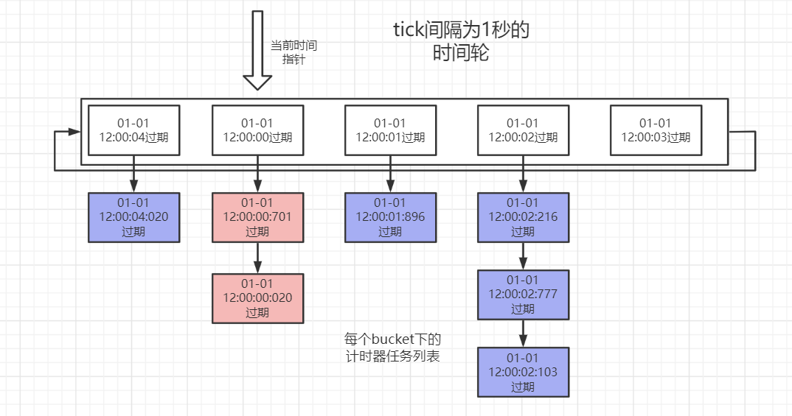

# 时间轮工作原理解析
## 一.时间轮介绍
### 1.时间轮的简单介绍
时间轮(TimeWheel)作为一种高效率的计时器实现方案，在1987年发表的论文Hashed and Hierarchical Timing Wheels中被首次提出。  
其被发明的主要目的在于解决当时操作系统的计时器功能实现中，维护一个定时器的开销随着所维护定时器数量的增多而逐渐变大的问题(时间复杂度为：O(n)、O(log n))。  
这导致操作系统**无法同时高效的维护大量计时器**，进一步导致一些优秀的、需要使用到大量定时器的的网络协议、实时控制系统等程序的实际表现不尽人意。
### 2.传统的计时器功能实现方式
计时器作为一种普遍的需求，理解起来是很简单的。计时器主要由两部分组成，即用户指定一个任务(task)，并在等待指定的时间(delayTime)后task将会被回调执行。  
在时间轮算法被发明出来之前，操作系统计时器功能的实现方式主要可以分为两种：**基于无序队列**和**基于有序队列**。
##### 基于无序队列实现的计时器
1. 新创建的计时器直接放在队列的末尾，时间复杂度为O(1)。  
2. 在每次硬件时钟tick中断时(per tick)，遍历当前队列中所有的计时器，将当前时间下过期的计时器移除队列并调度执行task,时间复杂度O(n)。  
**基于无序队列的计时器中，所维护的计时器总数量越多，则每次硬件时钟中断时的处理流程开销越大，最坏情况下甚至无法在一次时钟中断的间隔内完成计时器队列的遍历。**
##### 基于有序队列实现的计时器
1. 有序队列下，所有计时器按照过期时间进行排序，新创建的计时器加入队列时的时间复杂度为O(log n)(通常使用完全二叉堆来实现有序队列)。
2. 在每次硬件时钟tick中断时，仅检查队列的头部元素(最早过期的任务)是否过期。如果未过期则直接结束，如果已过期则将队首元素出队调度task，并再次重复上述过程，直至最新的队首元素不过期或队列为空。平均时间复杂度为O(1)。  
**基于有序队列的计时器中，所维护的计时器总数量越多，则每次用户创建新的计时器时的延迟越高，在需要反复创建大量计时器的场合下，性能不佳** 
#####
可以看到，在基于队列的计时器模块运行时，最关键的两个功能(创建新计时器/处理每次tick)至少有一个会随着总计时器数量的增大，而引起性能大幅度的下降。  
**juc中自带的ScheduledExecutorService调度线程池就是基于有序列表(二叉堆)的计时器。因此netty等需要大量使用计时器的框架需要另辟蹊径，采用时间轮来实现更高效的计时器功能。**
### 不同计时器实现与排序算法的关联
对基础数据结构有一定了解的读者会知道，常用的快速排序、归并排序等基于比较的高效排序算法其时间复杂度为O(n*log n)。
而基数排序(桶排序)的时间复杂度则是O(n)，其性能比上述基于比较的排序算法高出一个数量级。  
但基排序最大的缺陷则是对所要排序的数据集的排布有很高的要求，如果要排序的数据集的范围非常广，则所需要的桶(bucket)会非常多，空间复杂度会高到不可忍受。
举个例子，如果是对1万副扑克(不算大小王，52张牌)进行排序，由于扑克牌只有13种可能(A-K)，即使1万副扑克中牌的总数为52万张，基排序只需要13个桶就能在线性时间复杂度O(n)内完成排序。
但如果是对数据范围为0-1亿范围内的1万个随机数进行一次基排序，则基排序需要多达1亿个桶，其空间效率非常低，远逊于快速排序等基于比较的排序。
#####
截止目前，我们已经明确了两个关键点：
1. 基于有序列表的计时器，由于其基于比较的特征，所以插入时的时间复杂度O(log n)会随着计时器总量的增大而增加，在计时器总量成千上万时效率会急剧降低。
2. 对于一个较小的数据集范围，基排序的效率远高于快速排序等基于比较的排序算法。
#####
一般来说，一次时钟硬件的tick间隔非常小(纳秒级别)，如果想要用类似基排序的思想，使用一个巨大的数组来存储不同过期时间的计时器，
在理论上是可行的，但空间效率却低到无法在现有的内存硬件上实现(1纳秒对应1个bucket)。  
**但如果能容忍时钟调度的时间不是那么精确，则可以极大减少所需要的桶的数量。**  
举个例子，1毫秒等于1百万纳秒，如果时钟调度的精度不需要是纳秒级别，而是毫秒级别，则同一毫秒内的所有计时器(第100纳秒和第999999纳秒超时的计时器)都可以放在同一个桶中,所需要的数组空间减少了100万倍!  
时间轮算法就是基于这一特点产生的，即一定程度上舍弃调度时间的精确性，参考基排序的思路，实现在常数时间内创建新计时器，并同时在常数时间内完成时钟tick的处理。

### 3.时间轮计时器实现思路的简单介绍
下面我们简单的介绍一个基于时间轮的计时器的基本实现思路(还有很多可以优化的地方)：
1. 时间轮在创建时需要指定调度精度，即时间轮内部逻辑上1次tick的间隔。在上述例子中，调度精度为1毫秒，则时间轮实际上1次tick的间隔也就是1毫秒(类似的，我们平常见到的钟表中1次tick的间隔则是1秒钟)。
2. 维护一个桶数组，由于不同超时时间的任务可能会被映射到同一个桶中，因此数组桶中维护一个指向某一列表的指针(引用)。
3. 创建新计时器时，对于任意超时时间的任务基于tick间隔进行哈希，计算出需要存入的对应数组桶的下标(第100纳秒和第999999纳秒超时的计时器，都放入第0个桶)并插入对应桶的列表中。
4. 维护一个当前时间指针，指向某一个数组桶。每1次tick处理时，推动该指针，令其指向下一个tick对应的桶，并将桶指向的列表中的全部任务取出，丢到一个线程池中异步处理。
5. 为了节约空间，桶数组通常以环形数组的形式存储，因此这也是时间轮名字中轮(wheel)的来源。
#####

## 二.不同实现方式的时间轮的介绍
上面介绍的时间轮实现思路中绕过了一个很重要的问题，即在时间轮tick间隔确定的情况下，
虽然环形数组能够复用之前使用过的bucket槽，但bucket桶的数量**似乎**限制了时间轮所能支持的最大超时时间。  
举个例子，假设tick间隔为1毫秒，那么仅仅是存储距离当前时间1天(86400秒)后超时的任务就至少需要86400*1000个bucket，所占用的空间无疑是巨大的。
而一般的定时器模块所要支持的最大超时时间一般也不止1天这么短。  
虽然进一步的减少精度(比如tick间隔改为100毫秒，或者1秒)似乎能解决这个问题，但事实上时间轮的论文中也提到了一些更优秀的实现方案，使得能同时兼顾精度和减少空间占用。
### 单层多轮次时间轮
第一种方式是引入轮次(round)的概念(论文中提到的方案6)，即每一个bucket中的列表元素带上一个round属性。
假设一个时间轮的tick间隔为1秒，并且环形数组有86400个bucket桶，那么这个时间轮明面上可以支持的最大超时时间只有1天。而引入了轮次的概念后，则理论上可以支持的最大超时时间是没有限制的。  
##### 单层多轮次时间轮创建新任务
举个例子，假设有一个定时器任务的超时时间为2天10小时20分钟30秒，那么在创建新计时器任务时基于当前时间轮单轮次可以支持的最大超时时间(即一天)进行求余，
可以得到10小时20分钟30秒，根据余数我们可以计算出当前任务应该被插入到哪个bucket槽的列表中。而超时时间/最大超时时间(1天)得到除法的结果就是round轮次，即round=2。  
##### 单层多轮次时间轮tick处理
同时在每次tick处理当前时间指针所指向的列表时，不再简单的将列表中的所有任务一并取出执行，而是对其进行遍历。  
1. 只有round为0的任务才会被捞出来执行
2. 而round大于0的任务其逻辑上并没有真的超时，而只是将round自减1，等到后面的轮次处理直到自减为0后才代表着其真的超时而需要出队执行。  
#####
可以看到，**引入了round概念后，多轮次的时间轮兼顾了精度的同时，也能够在有限、可控的空间内支持足够大的超时时间。**
### 多层时间轮
论文中提到的另一种实现方案便是多层次时间轮(如论文题目所指Hashed and Hierarchical Timing Wheels)。  
多层时间轮的灵感来自于我们日常生活中随处可见的机械钟表。通常机械钟表有一个秒针(60秒)，一个分针(60分钟)和一个时针(12小时)，其本质上相当于一个tick间隔为1秒，支持的最大超时时间为12小时的多层时间轮。  
12小时有60*60*12=43200秒，但是钟表中实际上并没有这么多的bucket，却也能准确的表达12小时中的任何一秒。  
钟表中的秒针、分针和时针相当于三个不同层次的时间轮：
1. 秒针对应的时间轮是最底层的，共60个bucket，tick间隔为1秒钟
2. 分针对应的时间轮是第二层的，也是60个bucket，tick间隔为1分钟
3. 时针对应的时间轮是最上层的，共12个bucket，tick间隔为1小时
#####
在多层时间轮的实现中，可以建立N个不同层次的时间轮，其中上一层时间轮的tick间隔等于下一层时间轮走完一周的时间(类似1分钟等于60秒，1小时等于60分钟)。  
如果时间轮的层次足够多，理论上也能支持足够大范围的超时时间。
举个例子，精度为秒的的时间轮，只需要5层共(60+60+24+365+100)=609个bucket就能支持最大100年的超时时间(假设一年都是365天)。
##### 多层时间轮创建新任务
创建新计时器时，根据超时时间，先尝试着放入最底层的时间轮，如果最底层的时间轮能放的下(比如第0分钟58秒过期的),就根据当前时间轮的tick间隔做除法来计算出需要放入的具体bucket；
如果当前时间轮放不下(比如距离当前时间10分钟20秒过期的，无法直接放入最大60秒的秒级时间轮，但能放到最大支持60分钟的分钟时间轮中)，则尝试着放到上一层的时间轮中，但是是基于上一层的时间轮的tick间隔来做除法来计算出具体要放入的bucket槽。  
如果还是放不下(比如距离当前时间3小时20分钟18秒过期的，只能放到最大12小时的小时级时间轮中)。
循环往复这一过程，直到放到合适层次的时间轮中。
##### 多层时间轮tick处理
多层次的时间轮中的tick间隔是由最底层的时间轮决定的。  
每次tick时会推动当前时间，首先将最底层的时间轮中新指向的插槽中的任务全部取出进行调度；
接着判断当前时间轮是否走完了一整圈，如果是的话则推动上一层级的时间轮推进而指向新的bucket槽(比如秒级时间轮走完了60秒，则推进分针前进1格)。  
被推动的上层时间轮需要将新指向的bucket槽中的任务全部取出，尝试着放到下层时间轮中
(下一层或者下N层都由可能，比如超时时间为1小时10分钟30秒的任务会在小时时间轮从0推进到1时放到分钟时间轮里，而超时时间为1小时0分钟30秒的任务则会被直接放到最下层的秒钟时间轮里)。    
层级时间轮的tick推动是从下层蔓延到上层的，每次tick可能都会推动1至N层时间轮(比如第0小时第59分钟59秒->第1小时第0分钟第0秒就推动了2层)。
#####
todo 多层时间轮附图
## 三.时间轮实现的源码级分析
上面介绍的时间轮实现方式是很粗略的，连伪代码都不算。要想真正理解时间轮的工作原理，最好的办法还是通过参考已有实现，同时自己亲手实现一遍才会印象深刻。  
在本篇博客中将会介绍三种实现方式略有不同的时间轮，分别是：参考netty的单层多轮次时间轮、多层次时间轮(存在空转问题)、以及参考kafka的解决了空转问题的多层次时间轮。
**为了便于读者理解和阅读源码，相比netty或kafka中的工程化的实现，博客中实现的版本是简化过的，其只聚焦于时间轮本身的工作原理，而舍弃掉了关于取消定时任务、优雅启动/停止等相关的逻辑。**
######
为了便于测试，所有的时间轮实现都实现了一个自定义的Timer接口
```java
public interface Timer {

    /**
     * 启动时间轮
     * */
    void startTimeWheel();

    /**
     * 创建新的超时任务(必须先startTimeWheel完成后，才能创建新任务)
     * @param task 超时时需要调度的自定义任务
     * @param delayTime 延迟时间
     * @param timeUnit 延迟时间delayTime的单位
     * */
    void newTimeoutTask(Runnable task, long delayTime, TimeUnit timeUnit);
}
```
### 1.单层时间轮+多轮次(参考netty的实现)

### 2.层次时间轮(存在空转问题)
### 3.解决了空转问题的层次时间轮(参考kafka的实现)

## 总结