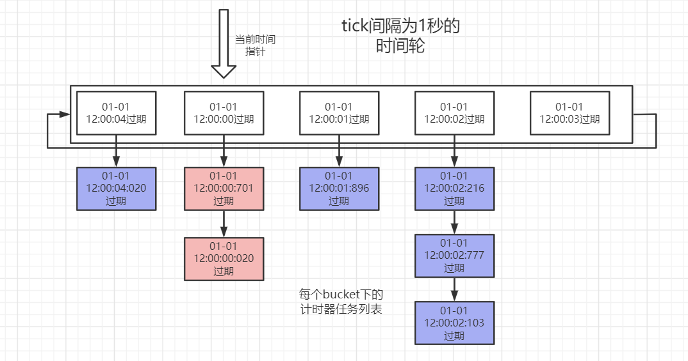

# 时间轮工作原理解析
## 一.时间轮介绍
### 1.时间轮的简单介绍
时间轮(TimeWheel)作为一种高效率的计时器实现方案，在1987年发表的论文Hashed and Hierarchical Timing Wheels中被首次提出。  
其被发明的主要目的在于解决当时操作系统的计时器功能实现中，维护一个定时器的开销随着所维护定时器数量的增多而逐渐变大的问题(时间复杂度为：O(n)、O(log n))。  
这导致操作系统**无法同时高效的维护大量计时器**，进一步导致一些优秀的、需要使用到大量定时器的的网络协议、实时控制系统等程序的实际表现不尽人意。
### 2.传统的计时器功能实现方式
计时器作为一种普遍的需求，理解起来是很简单的。计时器主要由两部分组成，即用户指定一个任务(task)，并在等待指定的时间(delayTime)后task将会被回调执行。  
在时间轮算法被发明出来之前，操作系统计时器功能的实现方式主要可以分为两种：**基于无序队列**和**基于有序队列**。
##### 基于无序队列实现的计时器
1. 新创建的计时器直接放在队列的末尾，时间复杂度为O(1)。  
2. 在每次硬件时钟tick中断时(per tick)，遍历当前队列中所有的计时器，将当前时间下过期的计时器移出队列并调度执行task,时间复杂度O(n)。  
**基于无序队列的计时器中，所维护的计时器总数量越多，则每次硬件时钟中断时的处理流程开销越大，最坏情况下甚至无法在一次时钟tick的间隔内完成计时器队列的遍历。**
##### 基于有序队列实现的计时器
1. 有序队列下，所有计时器按照过期时间进行排序，新创建的计时器加入队列时的时间复杂度为O(log n)(通常使用完全二叉堆来实现有序队列)。
2. 在每次硬件时钟tick中断时，仅检查队列的头部元素(最早过期的任务)是否过期。如果未过期则直接结束，如果已过期则将队首元素出队调度task，并再次重复上述过程，直至最新的队首元素不过期或队列为空。平均时间复杂度为O(1)。  
**基于有序队列的计时器中，所维护的计时器总数量越多，则每次用户创建新的计时器时的延迟越高，在需要反复创建大量计时器的场合下，性能不佳** 
#####
可以看到，在基于队列的计时器模块运行时，最关键的两个功能(创建新计时器/处理每次tick)至少有一个会随着总计时器数量的增大，而引起性能大幅度的下降。  
**juc中自带的ScheduledThreadPoolExecutor调度线程池就是基于有序列表(二叉堆)的计时器。因此netty等需要大量使用计时器的框架需要另辟蹊径，采用时间轮来实现更高效的计时器功能。**
### 不同计时器实现与排序算法的关联
对基础数据结构有一定了解的读者会知道，常用的快速排序、归并排序等基于比较的高效排序算法其时间复杂度为O(n*log n)。
而基数排序(桶排序)的时间复杂度则是O(n)，其性能比上述基于比较的排序算法高出一个数量级。  
但基排序最大的缺陷则是对所要排序的数据集的排布有很高的要求，如果要排序的数据集的范围非常广，则所需要的桶(bucket)会非常多，空间复杂度会高到不可忍受。  
举个例子，如果是对1万副扑克(不算大小王，52张牌)进行排序，由于扑克牌只有13种可能(A-K)，即使1万副扑克中牌的总数为52万张，基排序只需要13个桶就能在线性时间复杂度O(n)内完成排序。
但如果是对数据范围为0-1亿范围内的1万个随机数进行一次基排序，则基排序需要多达1亿个桶，其空间效率非常低，远逊于快速排序等基于比较的排序。
#####
截止目前，我们已经明确了两个关键点：
1. 基于有序列表的计时器，由于其基于比较的特征，所以插入时的时间复杂度O(log n)会随着计时器总量的增大而增加，在计时器总量成千上万时效率会急剧降低。
2. 对于一个较小的数据集范围，基排序的效率远高于快速排序等基于比较的排序算法。
#####
一般来说，一次时钟硬件的tick间隔非常小(纳秒级别)，如果想要用类似基排序的思想，使用一个巨大的数组来存储不同过期时间的计时器，
在理论上是可行的，但空间效率却低到无法在现有的内存硬件上实现(1纳秒对应1个bucket)。  
**但如果能容忍时钟调度的时间不是那么精确，则可以极大减少所需要的bucket桶的数量。**  
举个例子，1毫秒等于1百万纳秒，如果时钟调度的精度不需要是纳秒级别，而是毫秒级别，则同一毫秒内的所有计时器(第100纳秒和第999999纳秒超时的计时器)都可以放在同一个桶中,所需要的数组空间减少了100万倍!  
时间轮算法就是基于这一特点产生的，即一定程度上舍弃调度时间的精确性，参考基排序的思路，实现在常数时间内创建新计时器，并同时在常数时间内完成时钟tick的处理。

### 3.时间轮计时器实现思路的简单介绍
下面我们简单的介绍一个基于时间轮的计时器的基本实现思路(还有很多可以优化的地方)：
1. 时间轮在创建时需要指定调度精度，即时间轮内部逻辑上1次tick的间隔。  
   在上述例子中，调度精度为1毫秒，则时间轮实际上1次tick的间隔也就是1毫秒(类似的，我们平常见到的钟表中1次tick的间隔则是1秒钟)。
2. 维护一个桶数组，由于不同超时时间的任务可能会被映射到同一个桶中，因此数组桶中维护一个指向某一列表的指针(引用)。
3. 创建新计时器时，对于任意超时时间的任务基于tick间隔进行哈希，计算出需要存入的对应数组桶的下标(第100纳秒和第999999纳秒超时的计时器，都放入第0个桶)并插入对应桶的列表中。
4. 维护一个当前时间指针，指向某一个数组桶。每1次tick处理时，推动该指针，令其指向下一个tick对应的桶，并将桶指向的列表中的全部任务取出，丢到一个线程池中异步处理。
5. 为了节约空间，桶数组通常以环形数组的形式存储以重复利用bucket槽，这也是时间轮名字中轮(wheel)的来源。
#####

## 二.不同实现方式的时间轮的介绍
上面介绍的时间轮实现思路中绕过了一个很重要的问题，即在时间轮tick间隔确定的情况下，
虽然环形数组能够复用之前使用过的bucket槽，但bucket桶的数量**似乎**限制了时间轮所能支持的最大超时时间。  
举个例子，假设tick间隔为1毫秒，那么仅仅是存储距离当前时间1天(86400秒)后超时的任务就至少需要86400*1000个bucket，所占用的空间无疑是巨大的。
而一般的定时器模块所要支持的最大超时时间一般也不止1天这么短。  
虽然进一步的减少精度(比如tick间隔改为100毫秒，或者1秒)似乎能解决这个问题，但事实上时间轮的论文中还提到了一些更优秀的实现方案，使得能同时兼顾精度和减少空间占用。
### 单层多轮次时间轮
第一种方式是引入轮次(round)的概念(论文中提到的方案6)，即每一个bucket中的列表元素带上一个round属性。  
假设一个时间轮的tick间隔为1秒，并且环形数组有86400个bucket桶，那么这个时间轮明面上可以支持的最大超时时间只有1天。而引入了轮次的概念后，则理论上可以支持的最大超时时间是没有限制的。  
##### 单层多轮次时间轮创建新任务
举个例子，假设有一个定时器任务的超时时间为2天10小时20分钟30秒，那么在创建新计时器任务时基于当前时间轮单轮次可以支持的最大超时时间(即一天)进行求余，
可以得到10小时20分钟30秒，根据余数我们可以计算出当前任务应该被插入到哪个bucket槽的列表中。而超时时间/最大超时时间(1天)得到除法的结果就是round轮次，即round=2。  
##### 单层多轮次时间轮tick处理
同时在每次tick处理当前时间指针所指向的列表时，不再简单的将列表中的所有任务一并取出执行，而是对其进行遍历。  
1. 只有round为0的任务才会被捞出来执行
2. 而round大于0的任务其逻辑上并没有真的超时，而只是将round自减1，等到后面的轮次处理并最终自减为0后才代表着其真的超时而需要出队执行。  
#####
可以看到，**引入了round概念后，多轮次的时间轮兼顾了精度的同时，也能够在有限、可控的空间内支持足够大的超时时间。**
### 多层时间轮
论文中提到的另一种实现方案便是多层次时间轮(如论文题目所指Hashed and Hierarchical Timing Wheels)。  
多层时间轮的灵感来自于我们日常生活中随处可见的机械钟表。通常机械钟表有一个秒针(60秒)，一个分针(60分钟)和一个时针(12小时)，其本质上相当于一个tick间隔为1秒，支持的最大超时时间为12小时的多层时间轮。  
**12小时有60 * 60 * 12=43200秒，但是钟表中实际上并没有这么多的bucket，却也能准确的表达12小时中的任何一秒。** 
#####
这是因为钟表中的秒针、分针和时针本质上相当于三个不同层次的时间轮：
1. 秒针对应的时间轮是最底层的，共60个bucket，tick间隔为1秒钟
2. 分针对应的时间轮是第二层的，也是60个bucket，tick间隔为1分钟
3. 时针对应的时间轮是最上层的，共12个bucket，tick间隔为1小时
#####
在多层时间轮的实现中，可以建立N个不同层次的时间轮，其中上一层时间轮的tick间隔等于下一层时间轮走完一周的时间(类似1分钟等于60秒，1小时等于60分钟)。  
如果时间轮的层次足够多，理论上也能支持足够大范围的超时时间。
举个例子，精度为秒的的时间轮，只需要5层共(60+60+24+365+100)=609个bucket就能支持最大100年的超时时间(假设一年都是365天)。
##### 多层时间轮创建新任务
创建新计时器时，根据超时时间，先尝试着放入最底层的时间轮，如果最底层的时间轮能放的下(比如第0分钟58秒过期的),就根据当前时间轮的tick间隔做除法来计算出需要放入的具体bucket。  
如果当前时间轮放不下(比如距离当前时间10分钟20秒过期的，无法直接放入最大60秒的秒级时间轮，但能放到最大支持60分钟的分钟时间轮中)，则尝试着放到上一层的时间轮中，但是是基于上一层的时间轮的tick间隔来做除法来计算出具体要放入的bucket槽。  
如果还是放不下(比如距离当前时间3小时20分钟18秒过期的，只能放到最大12小时的小时级时间轮中)。  
循环往复这一过程，直到放到合适层次的时间轮中。
##### 多层时间轮tick处理
多层次的时间轮中的**基础tick间隔**是由最底层的时间轮决定的。  
每次tick时会推动当前时间，首先将最底层的时间轮中新指向的插槽中的任务全部取出进行调度；
接着判断当前时间轮是否走完了一整圈，如果是的话则推动上一层级的时间轮推进而指向新的bucket槽(比如秒级时间轮走完了60秒，则推进分针前进1格)。  
被推动的上层时间轮需要将新指向的bucket槽中的任务全部取出，尝试着放到下层时间轮中
(下一层或者下N层都有可能，比如超时时间为1小时10分钟30秒的任务会在小时时间轮从0推进到1时放到分钟时间轮里，而超时时间为1小时0分钟30秒的任务则会被直接放到最下层的秒钟时间轮里)。    
层级时间轮的tick推动是从下层蔓延到上层的，每次tick可能都会推动1至N层时间轮(比如第0小时第59分钟59秒->第1小时第0分钟第0秒就推动了2层)。
## 三.时间轮实现的源码级分析
上面介绍的时间轮实现方式是很粗略的，连伪代码都不算。要想真正理解时间轮的工作原理，最好的办法还是通过参考已有实现，并自己亲手实现一遍才会印象深刻。  
在本篇博客中将会结合源码介绍三种实现方式略有不同的时间轮，分别是：
1. 单层多轮次时间轮(参考netty的HashedWheelTimer实现)
2. 多层次时间轮(存在空转问题)
3. 解决了空转问题的多层次时间轮(参考kafka的Timer实现)
#####
**为了便于读者理解和阅读源码，相比netty或kafka中的工程化的实现，博客中实现的版本是简化过的，其只聚焦于时间轮本身的工作原理，而舍弃掉了关于取消定时任务、优雅启动/停止等相关的逻辑。**  
#####
为了便于测试，所有的时间轮实现都实现了一个自定义的Timer接口
```java
public interface Timer {

    /**
     * 启动时间轮
     * */
    void startTimeWheel();

    /**
     * 创建新的超时任务(必须先startTimeWheel完成后，才能创建新任务)
     * @param task 超时时需要调度的自定义任务
     * @param delayTime 延迟时间
     * @param timeUnit 延迟时间delayTime的单位
     * */
    void newTimeoutTask(Runnable task, long delayTime, TimeUnit timeUnit);
}
```
### 1.单层/多轮次时间轮(参考netty的实现)
* MyHashedTimeWheel是参考netty实现的单层多轮时间轮，其包含有一个环形数组ringBucketArray，数组中的每个槽(MyHashedTimeWheelBucket)都对应着一个存储任务节点的链表。
* 为了支持多线程并发的创建新任务，在创建新任务时，不是直接将其放入时间轮的环形数组中，而是先暂时存储在一个阻塞队列unProcessTaskQueue中。  
  而由模拟tick，推动当前时间的Worker线程来将其转移到环形数组中的(一个时间轮计时器只有一个Worker线程，所以是单线程操作无需考虑并发)。
* Worker线程会在时间轮启动后开始运行，其主要完成以下几个任务
  1. 最初启动时，设置时间轮的当前时间(System.nanoTime()区别于System.currentTimeMillis()不是获取现实中的绝对时间)。
  2. 随后执行一个无限循环，主要用于推进时间轮的当前时间。
  3. 因为java无法直接访问硬件时钟，本质上需要依赖操作系统层面的计时器来感知硬件时钟的变化。  
     所以无限循环中waitForNextTick方法中，基于Thread.sleep来模拟每次tick的间隔，以避免浪费CPU资源。
  4. 随后在waitForNextTick返回后，代表着当前时间轮推进了1tick，接着通过transferTaskToBuckets将当前unProcessTaskQueue队列中的新任务单线程挨个的加入时间轮中。  
     计算的过程如第二章中所描述的那样，基于实际需要等待的超时时间与当前时间轮最大间隔的余数获得应该插入的bucket槽的下标；基于除数获得剩余的rounds。
  5. 再然后处理当前时间指向的bucket槽中的所有任务(bucket.expireTimeoutTask)，如果任务的round<=0，则代表已经超时了，将其丢入指定的线程池中异步处理。  
     如果round>0，则将其自减1，等待后续的expireTimeoutTask最终将其减至0。
```java
/**
 * 参考netty实现的单层时间轮
 * */
public class MyHashedTimeWheel implements Timer{

    /**
     * 环形数组
     * */
    private final MyHashedTimeWheelBucket[] ringBucketArray;

    /**
     * 世间轮启动时的具体时间戳(单位：纳秒nanos)
     * */
    private long startTime;

    /**
     * 是否已启动
     * */
    private final AtomicBoolean started = new AtomicBoolean(false);

    /**
     * 时间轮每次转动的时间(单位：纳秒nanos)
     * (perTickTime越短，调度会更精确，但cpu开销也会越大)
     * */
    private final long perTickTime;

    /**
     * 总tick数
     * */
    private long totalTick = 0;

    /**
     * 待处理任务的队列
     * (多外部生产者写入，时间轮内的单worker消费者读取，所以netty的实现里使用了效率更高的MpscQueue，Mpsc即MultiProducerSingleConsumer)
     * */
    private final Queue<MyTimeoutTaskNode> unProcessTaskQueue = new LinkedBlockingDeque<>();

    /**
     * 用于实际执行到期任务的线程池
     * */
    private final Executor taskExecutor;

    private Thread workerThread;

    /**
     * 构造函数
     * */
    public MyHashedTimeWheel(int ringArraySize, long perTickTime, Executor taskExecutor) {
        this.ringBucketArray = new MyHashedTimeWheelBucket[ringArraySize];
        for(int i=0; i<ringArraySize; i++){
            // 初始化，填充满时间轮唤醒数组
            this.ringBucketArray[i] = new MyHashedTimeWheelBucket();
        }

        this.perTickTime = perTickTime;
        this.taskExecutor = taskExecutor;
    }

    /**
     * 启动worker线程等初始化操作，必须执行完成后才能正常工作
     * (简单起见，和netty不一样不是等任务被创建时才懒加载的，必须提前启动)
     * */
    @Override
    public void startTimeWheel(){
        // 启动worker线程
        this.workerThread = new Thread(new Worker());
        this.workerThread.start();

        while (!this.started.get()){
            // 自旋循环，等待一会
        }

        System.out.println("startTimeWheel 启动完成:" + this.getClass().getSimpleName());
    }

    @Override
    public void newTimeoutTask(Runnable task, long delayTime, TimeUnit timeUnit){
        long deadline = System.nanoTime() + timeUnit.toNanos(delayTime);

        // Guard against overflow.
        if (delayTime > 0 && deadline < 0) {
            deadline = Long.MAX_VALUE;
        }

        MyTimeoutTaskNode newTimeoutTaskNode = new MyTimeoutTaskNode();
        newTimeoutTaskNode.setTargetTask(task);
        newTimeoutTaskNode.setDeadline(deadline);

        unProcessTaskQueue.add(newTimeoutTaskNode);
    }

    private final class Worker implements Runnable{

        @Override
        public void run() {
            MyHashedTimeWheel.this.startTime = System.nanoTime();

            // 启动
            MyHashedTimeWheel.this.started.set(true);

            // 简单起见，不考虑优雅启动和暂停的逻辑
            while (true){
                // 等待perTick
                waitForNextTick();

                // 在捞取当前tick下需要处理的bucket前，先将加入到队列中的任务转移到环形数组中(可能包含在当前tick下就要处理的任务)
                transferTaskToBuckets();

                // 基于总tick数，对环形数组的长度取模，计算出当前tick下需要处理的bucket桶的下标
                int idx = (int) (MyHashedTimeWheel.this.totalTick % MyHashedTimeWheel.this.ringBucketArray.length);
                MyHashedTimeWheelBucket bucket = MyHashedTimeWheel.this.ringBucketArray[idx];
                // 处理当前插槽内的任务(遍历链表中的所有任务，round全部减一，如果减为负数了则说明这个任务超时到期了，将其从链表中移除后并交给线程池执行指定的任务)
                bucket.expireTimeoutTask(MyHashedTimeWheel.this.taskExecutor);
                // 循环tick一次，总tick数自增1
                MyHashedTimeWheel.this.totalTick++;
            }
        }

        /**
         * per tick时钟跳动，基于Thread.sleep
         * */
        private void waitForNextTick(){
            // 由于Thread.sleep并不是绝对精确的被唤醒，所以只能通过(('总的tick数+1' * '每次tick的间隔') + '时间轮启动时间')来计算精确的下一次tick时间
            // 而不能简单的Thread.sleep(每次tick的间隔)

            long nextTickTime = (MyHashedTimeWheel.this.totalTick + 1) * MyHashedTimeWheel.this.perTickTime
                            + MyHashedTimeWheel.this.startTime;

            // 因为nextTickTime是纳秒，sleep需要的是毫秒，需要保证纳秒数过小时，导致直接计算出来的毫秒数为0
            // 因此(‘实际休眠的纳秒数’+999999)/1000000,保证了纳秒转毫秒时，至少会是1毫秒，而不会出现sleep(0毫秒)令cpu空转
            long needSleepTime = (nextTickTime - System.nanoTime() + 999999) / 1000000;
            try {
                // 比起netty，忽略了一些处理特殊场景bug的逻辑
                Thread.sleep(needSleepTime);
            } catch (InterruptedException ignored) {

            }
        }

        private void transferTaskToBuckets() {
            // 为了避免worker线程在一次循环中处理太多的任务，所以直接限制了一个最大值100000
            // 如果真的有这么多，就等到下次tick循环的时候再去做。
            // 因为这个操作是cpu密集型的，处理太多的话，可能导致无法在一个短的tick周期内完成一次循环
            for (int i = 0; i < 100000; i++) {
                MyTimeoutTaskNode timeoutTaskNode = MyHashedTimeWheel.this.unProcessTaskQueue.poll();
                if (timeoutTaskNode == null) {
                    // 队列为空了，直接结束
                    return;
                }

                // 计算到任务超时时，应该执行多少次tick
                // (和netty里的不一样，这里的deadline是超时时间的绝对时间，所以需要先减去时间轮的startTime)
                // (netty中是生产者线程在add时事先减去了startTime，比起由worker线程统一处理效率更高，但个人觉得这里的写法会更直观)
                long totalTickWhenTimeout = (timeoutTaskNode.getDeadline() - MyHashedTimeWheel.this.startTime) / MyHashedTimeWheel.this.perTickTime;
                // 减去当前时间轮已经进行过的tick数量
                long remainingTickWhenTimeout = (totalTickWhenTimeout - MyHashedTimeWheel.this.totalTick);
                // 因为一次时间轮旋转会经过ringBucketArray.length次tick，所以求个余数
                long remainingRounds = remainingTickWhenTimeout / MyHashedTimeWheel.this.ringBucketArray.length;
                // 计算出当前任务需要转多少圈之后才会超时
                timeoutTaskNode.setRounds(remainingRounds);

                // 如果传入的deadline早于当前系统时间，则totalTickWhenTimeout可能会小于当前的totalTick
                // 这种情况下，让这个任务在当前tick下就立即超时而被调度是最合理的，而不能在求余后放到一个错误的位置而等一段时间才调度（所以必须取两者的最大值）
                final long ticks = Math.max(totalTickWhenTimeout, MyHashedTimeWheel.this.totalTick); // Ensure we don't schedule for past.
                // 如果能限制环形数组的长度为2的幂，则可以改为ticks & mask，位运算效率更高
                int stopIndex = (int) (ticks % MyHashedTimeWheel.this.ringBucketArray.length);
                MyHashedTimeWheelBucket bucket = MyHashedTimeWheel.this.ringBucketArray[stopIndex];
                // 计算并找到应该被放置的那个bucket后，将其插入当前bucket指向的链表中
                bucket.addTimeout(timeoutTaskNode);
            }
        }
    }
}
```
```java
/**
 * 时间轮环形数组下标对应的桶(保存一个超时任务MyTimeoutTaskNode的链表)
 * */
public class MyHashedTimeWheelBucket {

    private final LinkedList<MyTimeoutTaskNode> linkedList = new LinkedList<>();

    public void addTimeout(MyTimeoutTaskNode timeout) {
        linkedList.add(timeout);
    }

    /**
     * 遍历链表中的所有任务，round全部减一，如果减为负数了则说明这个任务超时到期了，将其从链表中移除后并交给线程池执行指定的任务
     * */
    public void expireTimeoutTask(Executor executor){
        Iterator<MyTimeoutTaskNode> iterator = linkedList.iterator();
        while(iterator.hasNext()){
            MyTimeoutTaskNode currentNode = iterator.next();
            long currentNodeRound = currentNode.getRounds();
            if(currentNodeRound <= 0){
                // 将其从链表中移除
                iterator.remove();
                // count小于等于0，说明超时了，交给线程池去异步执行
                executor.execute(currentNode.getTargetTask());
            }else{
                // 当前节点还未超时，round自减1
                currentNode.setRounds(currentNodeRound-1);
            }

            // 简单起见，不考虑任务被外部自己取消的case(netty里的timeout.isCancelled())
        }
    }
}
```
```java
public class MyTimeoutTaskNode {

    /**
     * 任务具体的到期时间(绝对时间)
     * */
    private long deadline;

    /**
     * 存储在时间轮中，需要等待的轮次
     * (rounds在初始化后，每次时间轮转动一周便自减1，当减为0时便代表当前任务需要被调度)
     * */
    private long rounds;

    /**
     * 创建任务时，用户指定的到期时进行调度的任务
     * */
    private Runnable targetTask;

    public long getDeadline() {
        return deadline;
    }

    public void setDeadline(long deadline) {
        this.deadline = deadline;
    }

    public long getRounds() {
        return rounds;
    }

    public void setRounds(long rounds) {
        this.rounds = rounds;
    }

    public Runnable getTargetTask() {
        return targetTask;
    }

    public void setTargetTask(Runnable targetTask) {
        this.targetTask = targetTask;
    }
}
```
### 2.层次时间轮(存在空转问题)
层次时间轮MyHierarchicalHashedTimerV1的主体逻辑与单层多轮次时间轮MyHashedTimeWheel基本保持一致，主要的区别有几点：
1. 由于是多层次的时间轮，所以单独抽象出了Timer(MyHierarchicalHashedTimerV1)和TimerWheel(MyHierarchicalHashedTimeWheelV1)这两个类。  
   Timer类中只持有最底层的时间轮lowestTimeWheel，而单独的时间轮类MyHierarchicalHashedTimeWheelV1中也存储了更上层时间轮的引用overFlowWheel。  
   不同层次的时间轮之间按照层级构成了一个单向链表。
2. 从unProcessTaskQueue中转移计时器任务到环形数组时(MyHierarchicalHashedTimeWheelV1.addTimeoutTask)，  
   如果当前时间轮的最大间隔内也放不下任务，则会尝试着将其放入上层的时间轮中；如果上层时间轮不存在则创建之(lazy加载)。  
   考虑到超时时间可能会很大，所以addTimeoutTask方法可能会递归调用多次，直到找到一个间隔足够大的时间轮来存储任务。  
3. 在推动tick时(advanceClockByTick)，先推动最底层的时间轮(level为0)，将指向的bucket列表中的任务全部交给指定的线程池执行。  
   同时，如果当前时间轮已经走完一圈后，则去推动上一层的时间轮(可能递归多次)。  
   上层的时间轮(level>0)在推动时，通过重新执行advanceClockByTick，将对应bucket列表中的任务转移到更下层的时间轮中。
```java
/**
 * 层次时间轮，会存在空转问题
 * */
public class MyHierarchicalHashedTimerV1 implements Timer {

    /**
     * 是否已启动
     * */
    private AtomicBoolean started = new AtomicBoolean(false);

    /**
     * 世间轮启动时的具体时间戳(单位：纳秒nanos)
     * */
    private long startTime;

    /**
     * 时间轮每次转动的时间(单位：纳秒nanos)
     * (perTickTime越短，调度会更精确，但cpu开销也会越大)
     * */
    private final long perTickTime;

    /**
     * 总tick数
     * */
    private long totalTick = 0;

    /**
     * 待处理任务的队列
     * (多外部生产者写入，时间轮内的单worker消费者读取，所以netty的实现里使用了效率更高的MpscQueue，Mpsc即MultiProducerSingleConsumer)
     * */
    private final Queue<MyTimeoutTaskNode> unProcessTaskQueue = new LinkedBlockingDeque<>();

    /**
     * timer持有的最低层的时间轮
     * */
    private final MyHierarchicalHashedTimeWheelV1 lowestTimeWheel;

    /**
     * 构造函数
     * */
    public MyHierarchicalHashedTimerV1(int ringArraySize, long perTickTime, Executor taskExecutor) {
        this.perTickTime = perTickTime;

        // 初始化最底层的时间轮
        this.lowestTimeWheel = new MyHierarchicalHashedTimeWheelV1(ringArraySize,perTickTime,taskExecutor,0);
    }

    /**
     * 启动worker线程等初始化操作，必须执行完成后才能正常工作
     * (简单起见，和netty不一样不是等任务被创建时才懒加载的，必须提前启动)
     * */
    @Override
    public void startTimeWheel(){
        // 启动worker线程
        new Thread(new Worker()).start();

        while (!this.started.get()){
            // 自旋循环，等待一会
        }

        System.out.println("startTimeWheel 启动完成:" + this.getClass().getSimpleName());
    }

    @Override
    public void newTimeoutTask(Runnable task, long delayTime, TimeUnit timeUnit){
        long deadline = System.nanoTime() + timeUnit.toNanos(delayTime);

        // Guard against overflow.
        if (delayTime > 0 && deadline < 0) {
            deadline = Long.MAX_VALUE;
        }

        MyTimeoutTaskNode newTimeoutTaskNode = new MyTimeoutTaskNode();
        newTimeoutTaskNode.setTargetTask(task);
        newTimeoutTaskNode.setDeadline(deadline);

        this.unProcessTaskQueue.add(newTimeoutTaskNode);
    }

    private final class Worker implements Runnable{

        @Override
        public void run() {
            MyHierarchicalHashedTimerV1.this.startTime = System.nanoTime();
            // 启动
            MyHierarchicalHashedTimerV1.this.started.set(true);

            // 简单起见，不考虑优雅启动和暂停的逻辑
            while (true){
                // 等待perTick
                waitForNextTick();

                // 在捞取当前tick下需要处理的bucket前，先将加入到队列中的任务转移到时间轮中(可能包含在当前tick下就要处理的任务)
                // 层级时间轮内部会做进一步的分配(放不下的话就溢出到更上一层的时间轮)
                transferTaskToTimeWheel();

                // 推进时间轮(层级时间轮内部满了一圈就会进一步的推进更上一层的时间轮)
                MyHierarchicalHashedTimerV1.this.lowestTimeWheel.advanceClockByTick(
                    (taskNode)->
                        // 参考kafka的写法，避免Timer里的一些属性被传到各个bucket里面
                        MyHierarchicalHashedTimerV1.this.lowestTimeWheel
                            .addTimeoutTask(MyHierarchicalHashedTimerV1.this.startTime, taskNode)
                );

                // 循环tick一次，总tick数自增1
                MyHierarchicalHashedTimerV1.this.totalTick++;
            }
        }

        /**
         * per tick时钟跳动，基于Thread.sleep
         * */
        private void waitForNextTick(){
            // 由于Thread.sleep并不是绝对精确的被唤醒，所以只能通过(('总的tick数+1' * '每次tick的间隔') + '时间轮启动时间')来计算精确的下一次tick时间
            // 而不能简单的Thread.sleep(每次tick的间隔)

            long nextTickTime = (MyHierarchicalHashedTimerV1.this.totalTick + 1) * MyHierarchicalHashedTimerV1.this.perTickTime
                + MyHierarchicalHashedTimerV1.this.startTime;

            // 因为nextTickTime是纳秒，sleep需要的是毫秒，需要保证纳秒数过小时，导致直接计算出来的毫秒数为0
            // 因此(‘实际休眠的纳秒数’+999999)/1000000,保证了纳秒转毫秒时，至少会是1毫秒，而不会出现sleep(0毫秒)令cpu空转
            long needSleepTime = (nextTickTime - System.nanoTime() + 999999) / 1000000;
            
            try {
                // 比起netty，忽略了一些处理特殊场景bug的逻辑
                Thread.sleep(needSleepTime);
            } catch (InterruptedException ignored) {

            }
        }

        /**
         * 加入到队列中的任务转移到时间轮中
         * */
        private void transferTaskToTimeWheel() {
            // 为了避免worker线程在一次循环中处理太多的任务，所以直接限制了一个最大值100000
            // 如果真的有这么多，就等到下次tick循环的时候再去做。
            // 因为这个操作是cpu密集型的，处理太多的话，可能导致无法在一个短的tick周期内完成一次循环
            for (int i = 0; i < 100000; i++) {
                MyTimeoutTaskNode timeoutTaskNode = MyHierarchicalHashedTimerV1.this.unProcessTaskQueue.poll();
                if (timeoutTaskNode == null) {
                    // 队列为空了，直接结束
                    return;
                }

                // 层级时间轮内部会做进一步的分配(放不下的话就溢出到更上一层的时间轮)
                MyHierarchicalHashedTimerV1.this.lowestTimeWheel.addTimeoutTask(
                    MyHierarchicalHashedTimerV1.this.startTime, timeoutTaskNode);
            }
        }
    }
}
```
```java
public class MyHierarchicalHashedTimeWheelV1 {

    private final MyHierarchyHashedTimeWheelBucketV1[] ringBucketArray;

    /**
     * 总tick数
     * */
    private long totalTick = 0;

    /**
     * 当前时间轮所能承载的时间间隔
     * */
    private final long interval;

    /**
     * 时间轮每次转动的时间(单位：纳秒nanos)
     * (perTickTime越短，调度会更精确，但cpu开销也会越大)
     * */
    private final long perTickTime;

    /**
     * 上一层时间跨度更大的时间轮
     * */
    private MyHierarchicalHashedTimeWheelV1 overFlowWheel;

    /**
     * 用于实际执行到期任务的线程池
     * */
    private final Executor taskExecutor;

    /**
     * 是否是最底层的时间轮（只有最底层的时间轮才真正的对任务进行调度）
     * */
    private final int level;

    public MyHierarchicalHashedTimeWheelV1(int ringArraySize,long perTickTime, Executor taskExecutor,int level) {
        this.ringBucketArray = new MyHierarchyHashedTimeWheelBucketV1[ringArraySize];
        for(int i=0; i<ringArraySize; i++){
            // 初始化，填充满时间轮唤醒数组
            this.ringBucketArray[i] = new MyHierarchyHashedTimeWheelBucketV1();
        }

        this.perTickTime = perTickTime;
        this.taskExecutor = taskExecutor;
        this.interval = perTickTime * ringArraySize;
        this.level = level;

        if(level > 0){
            this.totalTick = 1;
        }
    }

    /**
     * 当前时间轮加入任务(溢出的话，则需要放到上一层的时间轮中)
     * */
    public void addTimeoutTask(long startTime, MyTimeoutTaskNode timeoutTaskNode){
        long deadline = timeoutTaskNode.getDeadline();

        // 当前时间轮所能承载的最大绝对时间为：每个tick的间隔 * 插槽数 + (基于startTime的当前绝对时间)
        long currentWheelMaxRange = this.interval + (startTime + this.perTickTime * this.totalTick);

        if(deadline < currentWheelMaxRange){
            // 当前时间轮能够承载这个任务，无需放到上一层时间轮中

            // 计算到任务超时时，应该执行多少次tick
            // (和netty里的不一样，这里的deadline是超时时间的绝对时间，所以需要先减去时间轮的startTime)
            // (netty中是生产者线程在add时事先减去了startTime，比起由worker线程统一处理效率更高，但个人觉得这里的写法会更直观)
            long totalTickWhenTimeout = (deadline - startTime) / this.perTickTime;

            // 如果传入的deadline早于当前系统时间，则totalTickWhenTimeout可能会小于当前的totalTick
            // 这种情况下，让这个任务在当前tick下就立即超时而被调度是最合理的，而不能在求余后放到一个错误的位置而等一段时间才调度（所以必须取两者的最大值）
            final long ticks = Math.max(totalTickWhenTimeout, this.totalTick); // Ensure we don't schedule for past.
            // 如果能限制环形数组的长度为2的幂，则可以改为ticks & mask，位运算效率更高
            int stopIndex = (int) (ticks % this.ringBucketArray.length);

            MyHierarchyHashedTimeWheelBucketV1 bucket = this.ringBucketArray[stopIndex];
            // 计算并找到应该被放置的那个bucket后，将其插入当前bucket指向的链表中
            bucket.addTimeout(timeoutTaskNode);
        }else{
            // 当前时间轮无法承载这个任务，需要放到上一层时间轮中

            // 上层时间轮不存在，创建之
            if(this.overFlowWheel == null){
                // 上层时间轮的环形数组大小保持不变，perTick是当前时间轮的整个间隔(类似低层的60秒等于上一层的1分钟)
                this.overFlowWheel = new MyHierarchicalHashedTimeWheelV1(
                    this.ringBucketArray.length, this.interval, taskExecutor,this.level+1);
            }

            // 加入到上一层的时间轮中(对于较大的deadline，addTimeoutTask操作可能会递归数次，放到第N层的时间轮中)
            this.overFlowWheel.addTimeoutTask(startTime,timeoutTaskNode);
        }
    }

    public void advanceClockByTick(Consumer<MyTimeoutTaskNode> flushInLowerWheelFn){
        // 基于总tick数，对环形数组的长度取模，计算出当前tick下需要处理的bucket桶的下标
        int idx = (int) (this.totalTick % this.ringBucketArray.length);

        MyHierarchyHashedTimeWheelBucketV1 bucket = this.ringBucketArray[idx];

        if(this.level == 0){
            // 如果是最底层的时间轮，将当前tick下命中的bucket中的任务丢到taskExecutor中执行
            bucket.expireTimeoutTask(this.taskExecutor);
        }else{
            // 如果不是最底层的时间轮，将当前tick下命中的bucket中的任务交给下一层的时间轮
            // 这里转交到下一层有两种方式：第一种是从上到下的转交，另一种是当做新任务一样还是从最下层的时间轮开始放，放不下再往上溢出
            // 选用后一种逻辑，最大的复用已有的创建新任务的逻辑，会好理解一点
            bucket.flush(flushInLowerWheelFn);
        }

        // 当前时间轮的总tick自增1
        this.totalTick++;

        // 当前时间轮的总tick数满了一圈之后，推进上一层时间轮进行一次tick(如果上一层时间轮存在的话)
        if(this.totalTick % this.ringBucketArray.length == 0 && this.overFlowWheel != null){
            this.overFlowWheel.advanceClockByTick(flushInLowerWheelFn);
        }
    }
}
```
```java
/**
 * 时间轮环形数组下标对应的桶(保存一个超时任务MyTimeoutTaskNode的链表)
 * */
public class MyHierarchyHashedTimeWheelBucketV1 {

    private final LinkedList<MyTimeoutTaskNode> linkedList = new LinkedList<>();

    public void addTimeout(MyTimeoutTaskNode timeout) {
        linkedList.add(timeout);
    }

    /**
     * 遍历链表中的所有任务，round全部减一，如果减为负数了则说明这个任务超时到期了，将其从链表中移除后并交给线程池执行指定的任务
     * */
    public void expireTimeoutTask(Executor executor){
        Iterator<MyTimeoutTaskNode> iterator = linkedList.iterator();
        while(iterator.hasNext()){
            MyTimeoutTaskNode currentNode = iterator.next();
            long currentNodeRound = currentNode.getRounds();
            if(currentNodeRound <= 0){
                // 将其从链表中移除
                iterator.remove();
                // count小于等于0，说明超时了，交给线程池去异步执行
                executor.execute(currentNode.getTargetTask());
            }else{
                // 当前节点还未超时，round自减1
                currentNode.setRounds(currentNodeRound-1);
            }

            // 简单起见，不考虑任务被外部自己取消的case(netty里的timeout.isCancelled())
        }
    }

    /**
     * 将当前bucket中的数据，通过flushInLowerWheelFn，全部转移到更底层的时间轮中
     * */
    public void flush(Consumer<MyTimeoutTaskNode> flushInLowerWheelFn){
        Iterator<MyTimeoutTaskNode> iterator = linkedList.iterator();
        while(iterator.hasNext()){
            MyTimeoutTaskNode currentNode = iterator.next();
            // 先从链表中移除
            iterator.remove();
            // 通过flushInLowerWheelFn，转移到更底层的时间轮中
            flushInLowerWheelFn.accept(currentNode);

            // 简单起见，不考虑任务被外部自己取消的case(netty里的timeout.isCancelled())
        }
    }
}
```
### 3.解决了空转问题的层次时间轮(参考kafka的实现)
上面实现的单层多轮时间轮以及层次时间轮都存在一个问题，即时间轮论文中提到的空转问题(step through an empty bucket)。  
举个例子，假设时间轮的tick间隔被设置为1秒，用户创建了一个10秒后过期的任务和一个10小时后过期的任务。在处理完了第一个10秒后过期的任务后，剩下的几万次tick都由于每个时间轮当前时间指向的bucket是一个空列表而在做无用功。  
**生产环境中为了保证一定的调度精度，tick间隔一般会设置为毫秒级别甚至更低，那么时间轮空转对CPU的浪费就不是一个可以忽视的问题了。**
#####
在著名的消息队列kafka中就实现了一个能解决空转问题的层次时间轮(Timer/TimingWheel)，其解决时间轮空转的方式是引入延迟队列。  
请注意：这里的延迟队列不是用于存储计时器任务的，而是用来存储bucket槽的(MyHierarchyHashedTimeWheelBucketV2)。
前面提到，时间轮插槽的数量是相对固定的，其远远少于计时器任务的数量，所以不会出现性能瓶颈。 
#####
MyHierarchicalHashedTimerV2由于引入了延迟队列，所以在实现上相对复杂了一些。
* 在每次bucket槽中插入第一个新元素时(两种情况：一是时间轮刚刚初始化从未插入过元素，二是当前bucket槽中的元素已经在之前的一次tick中被全部处理完了)，
将当前bucket插槽插入延迟队列(DelayQueue)中。
* bucket插槽中维护了一个expiration超时时间属性，其代表着当前插槽距离下一次被当前时间指针推动而被指到的绝对时间。  
  假设有一个时分秒三层的时间轮，当前时间为1小时5分0秒，如果一个超时时间为2分10秒的任务创建时，其将会被放入分钟时间轮的第6个插槽中(下标从0开始)，
  由于对应插槽将会在2分钟后被当前时间指针指到，所以其expiration的值当前时间1小时5分0秒+2分。
* bucket是实现了Delayed接口的，其实际返回的是expiration减去当前时间的值(之所以减去当前时间，是因为延迟队列中只有getDelay小于等于0才可以出队)。
  bucket在被加入延迟队列时，会实际上会按照getDelayed计算的值来进行排序，因此时间轮中理论上越早会被调度的bucket槽，越先出队。
* 与v1版本不同，Worker线程不再是基于固定的tick间隔来休眠并推进时间，而是监听延迟队列(bucketDelayQueue.take)。
  当延迟队列中的bucket到了超时时间时，便会被Worker取出，并进行同样的推动操作；而那些空的bucket则不会被感知到，从而解决了空转问题。
* 同样的例子，如果1秒的tick间隔下，1个10秒过期和1个10小时过期的任务创建并最终处理。    
  MyHierarchicalHashedTimerV2中的Worker线程总共只会在当前时间指向的bucket不为空时才会被唤醒(个位数级别的tick处理),而不会一直空转。
#####
```java
public class MyHierarchicalHashedTimerV2 implements Timer {

    /**
     * 是否已启动
     * */
    private AtomicBoolean started = new AtomicBoolean(false);

    /**
     * 关联的最底层时间轮
     * */
    private volatile MyHierarchicalHashedTimeWheelV2 lowestTimeWheel;

    /**
     * 时间轮的启动时间（单位:纳秒）
     * */
    private long startTime;

    /**
     * 每次tick的间隔（单位:纳秒）
     * */
    private final long perTickTime;

    /**
     * 时间轮的大小
     * */
    private final int timeWheelSize;

    /**
     * 用于实际执行到期任务的线程池
     * */
    private final Executor taskExecutor;

    /**
     * 用于存储bucket元素的延迟队列，用于解决时间轮空转的问题
     * */
    private final DelayQueue<MyHierarchyHashedTimeWheelBucketV2> bucketDelayQueue = new DelayQueue<>();

    public MyHierarchicalHashedTimerV2(int timeWheelSize,long perTickTime, Executor taskExecutor) {
        this.timeWheelSize = timeWheelSize;
        this.perTickTime = perTickTime;
        this.taskExecutor = taskExecutor;
    }

    /**
     * 启动worker线程等初始化操作，必须执行完成后才能正常工作
     * (简单起见，和netty不一样不是等任务被创建时才懒加载的，必须提前启动)
     * */
    @Override
    public void startTimeWheel(){
        // 启动worker线程
        new Thread(new Worker()).start();

        while (!this.started.get()){
            // 自旋循环，等待一会
        }

        System.out.println("startTimeWheel 启动完成:" + this.getClass().getSimpleName());
    }

    @Override
    public void newTimeoutTask(Runnable task, long delayTime, TimeUnit timeUnit){
        long deadline = System.nanoTime() + timeUnit.toNanos(delayTime);

        // Guard against overflow.
        if (delayTime > 0 && deadline < 0) {
            deadline = Long.MAX_VALUE;
        }

        MyTimeoutTaskNode newTimeoutTaskNode = new MyTimeoutTaskNode();
        newTimeoutTaskNode.setTargetTask(task);
        newTimeoutTaskNode.setDeadline(deadline);

        // 加入到最底层的时间轮中，当前时间轮放不下的会溢出都上一层时间轮
        this.lowestTimeWheel.addTimeoutTask(newTimeoutTaskNode);
    }

    private void advanceClock(){
        try {
            MyHierarchyHashedTimeWheelBucketV2 bucket = this.bucketDelayQueue.take();
            lowestTimeWheel.advanceClockByTick(bucket.getExpiration());
            bucket.flush((node)->{
                // 当前选中的bucket中的任务，重新插入到时间轮中
                // 1 原本处于高层的bucket中的任务会被放到更底层
                // 2 原本就处于最低一层的bucket中的任务会被直接执行
                this.lowestTimeWheel.addTimeoutTask(node);
            });
            // 将当前时间轮的数据
        } catch (Exception e) {
            // 忽略掉异常
            e.printStackTrace();
        }
    }


    private final class Worker implements Runnable {
        @Override
        public void run() {
            MyHierarchicalHashedTimerV2.this.startTime = System.nanoTime();

            // 初始化最底层的时间轮
            MyHierarchicalHashedTimerV2.this.lowestTimeWheel = new MyHierarchicalHashedTimeWheelV2(
                MyHierarchicalHashedTimerV2.this.startTime,
                MyHierarchicalHashedTimerV2.this.perTickTime,
                MyHierarchicalHashedTimerV2.this.timeWheelSize,
                MyHierarchicalHashedTimerV2.this.taskExecutor,
                MyHierarchicalHashedTimerV2.this.bucketDelayQueue
            );

            // 启动
            MyHierarchicalHashedTimerV2.this.started.set(true);

            while (true){
                // 一直无限循环，不断推进时间
                advanceClock();
            }
        }
    }
}
```
```java
public class MyHierarchicalHashedTimeWheelV2 {

    /**
     * 上层时间轮（生产者/消费者都会访问到，volatile修饰）
     * */
    private volatile MyHierarchicalHashedTimeWheelV2 overflowTimeWheel;

    /**
     * 每次tick的间隔（单位:纳秒）
     * */
    private final long perTickTime;

    /**
     * 时间轮环形数组
     * */
    private final MyHierarchyHashedTimeWheelBucketV2[] ringBucketArray;

    /**
     * 用于实际执行到期任务的线程池
     * */
    private final Executor taskExecutor;

    /**
     * 时间轮的当前时间
     * */
    private long currentTime;

    /**
     * 当前时间轮的间隔(每次tick的时间 * 时间轮的大小)
     * */
    private final long interval;

    private final DelayQueue<MyHierarchyHashedTimeWheelBucketV2> bucketDelayQueue;

    public MyHierarchicalHashedTimeWheelV2(long startTime, long perTickTime, int wheelSize, Executor taskExecutor,
                                           DelayQueue<MyHierarchyHashedTimeWheelBucketV2> bucketDelayQueue) {
        // 初始化环形数组
        this.ringBucketArray = new MyHierarchyHashedTimeWheelBucketV2[wheelSize];
        for(int i=0; i<wheelSize; i++){
            this.ringBucketArray[i] = new MyHierarchyHashedTimeWheelBucketV2();
        }

        // 初始化时，当前时间为startTime
        this.currentTime = startTime - (startTime % perTickTime);
        this.perTickTime = perTickTime;
        this.taskExecutor = taskExecutor;
        this.interval = perTickTime * wheelSize;
        this.bucketDelayQueue = bucketDelayQueue;
    }

    public void addTimeoutTask(MyTimeoutTaskNode timeoutTaskNode) {
        long deadline = timeoutTaskNode.getDeadline();
        if(deadline < this.currentTime + this.perTickTime){
            // 超时时间小于1tick，直接执行
            this.taskExecutor.execute(timeoutTaskNode.getTargetTask());
        }else if(deadline < this.currentTime + this.interval){
            // 当前时间轮放的下

            // 在超时时，理论上总共需要的tick数
            long totalTick = deadline / this.perTickTime;

            // 如果传入的deadline早于当前系统时间，则totalTickWhenTimeout可能会小于当前的totalTick
            // 这种情况下，让这个任务在当前tick下就立即超时而被调度是最合理的，而不能在求余后放到一个错误的位置而等一段时间才调度（所以必须取两者的最大值）
            // 如果能限制环形数组的长度为2的幂，则可以改为ticks & mask，位运算效率更高
            int stopIndex = (int) (totalTick % this.ringBucketArray.length);

            MyHierarchyHashedTimeWheelBucketV2 bucket = this.ringBucketArray[stopIndex];
            // 计算并找到应该被放置的那个bucket后，将其插入当前bucket指向的链表中
            bucket.addTimeout(timeoutTaskNode);

            // deadline先除以this.perTickTime再乘以this.perTickTime,可以保证放在同一个插槽下的任务，expiration都是一样的
            long expiration = totalTick * this.perTickTime;
            boolean isNewRound = bucket.setExpiration(expiration);
            if(isNewRound){
                this.bucketDelayQueue.offer(bucket);
            }
        }else{
            // 当前时间轮放不下
            if(this.overflowTimeWheel == null){
                createOverflowWheel();
            }

            // 加入到上层的时间轮中(较大的deadline会递归多次)
            this.overflowTimeWheel.addTimeoutTask(timeoutTaskNode);
        }
    }

    /**
     * 推进当前时间轮的时钟
     * 举个例子：假设当前时间轮的当前时间是第10分钟，perTickTime是1分钟，
     * 1.如果expiration是第10分钟第1秒，则不用推动当前时间
     * 2.如果expiration是第11分钟第0秒，则需要推动当前时间
     * */
    public void advanceClockByTick(long expiration){
        // 只会在tick推进时才会被调用，参数expiration可以认为是当前时间轮的系统时间
        if(expiration >= this.currentTime + this.perTickTime){
            // 超过了1tick，则需要推进当前时间轮 (始终保持当前时间是perTickTime的整数倍，逻辑上的totalTick)
            this.currentTime = expiration - (expiration % this.perTickTime);
            if(this.overflowTimeWheel != null){
                // 如果上层时间轮存在，则递归的继续推进
                this.overflowTimeWheel.advanceClockByTick(expiration);
            }
        }
    }

    private synchronized void createOverflowWheel(){
        if(this.overflowTimeWheel == null){
            // 创建上层时间轮，上层时间轮的perTickTime = 当前时间轮的interval
            this.overflowTimeWheel = new MyHierarchicalHashedTimeWheelV2(
                this.currentTime, this.interval, this.ringBucketArray.length, this.taskExecutor, this.bucketDelayQueue);
        }
    }
}
```
```java
public class MyHierarchyHashedTimeWheelBucketV2 implements Delayed {

    private final LinkedList<MyTimeoutTaskNode> taskList = new LinkedList<>();

    private final AtomicLong expiration = new AtomicLong(-1);

    public synchronized void addTimeout(MyTimeoutTaskNode timeout) {
        taskList.add(timeout);
    }

    public synchronized void flush(Consumer<MyTimeoutTaskNode> flush) {
        Iterator<MyTimeoutTaskNode> iterator = taskList.iterator();
        while (iterator.hasNext()){
            MyTimeoutTaskNode node = iterator.next();
            // 从当前bucket中移除，转移到更下层的时间轮中
            iterator.remove();
            flush.accept(node);

            // 简单起见，不考虑任务被外部自己取消的case(netty里的timeout.isCancelled())
        }

        this.expiration.set(-1L);
    }

    /**
     * 设置当前bucket的超时时间
     * @return 是否是一个新的bucket  true：是
     * */
    public boolean setExpiration(long expiration){
        long oldValue = this.expiration.getAndSet(expiration);

        // 如果不一样，说明当前的expiration已经超过了原来的expiration一圈了，逻辑上不再是同一个bucket
        return oldValue != expiration;
    }

    public long getExpiration(){
        return this.expiration.get();
    }

    @Override
    public long getDelay(TimeUnit unit) {
        // 还剩余多少时间过期
        long delayNanos = Math.max(this.expiration.get() - System.nanoTime(), 0);

        // 将纳秒单位基于unit转换
        return unit.convert(delayNanos,TimeUnit.NANOSECONDS);
    }

    @Override
    public int compareTo(Delayed o) {
        if(o instanceof MyHierarchyHashedTimeWheelBucketV2){
            return Long.compare(this.expiration.get(),((MyHierarchyHashedTimeWheelBucketV2) o).expiration.get());
        }

        return 0;
    }
}
```
### 为什么netty的时间轮不解决空转问题？(个人理解)
netty作为一个网络框架，大量的计时器任务的超时时间都是相对较短的(最大一般是秒级)，时间上的排布相对密集，时间轮空转的问题不是特别大(rounds的值也会很小，从创建到被调度的开销很低)。  
而kafka的计时器模块所要处理的任务其超时时间的跨度就相对大很多，时间上的排布很稀疏，所以引入延迟队列来解决空转问题收益就会大很多。
## 总结
* 虽然很早就了解过时间轮的概念，但直到自己造RPC框架轮子玩的时候才发现自己对时间轮的工作原理了解的并不深。  
  说来惭愧，当时的我甚至无法很好的回答为什么netty、dubbo等框架要用到计时器的地方不去使用jdk现成的ScheduledThreadPoolExecutor而要自己写一个时间轮。  
* 基于费曼学习法，我仔细的研究了时间轮的论文并参考已有的开源实现，重新实现了几种简化版的时间轮，并以技术博客的形式分享出来，希望能帮助到对时间轮工作原理感兴趣的人。
* 本篇博客的完整代码在我的github上：https://github.com/1399852153/Reinventing-the-wheel-for-learning（timeWheel模块） 内容如有错误，还请多多指教。