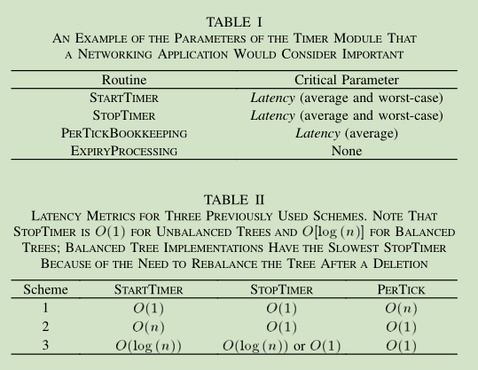
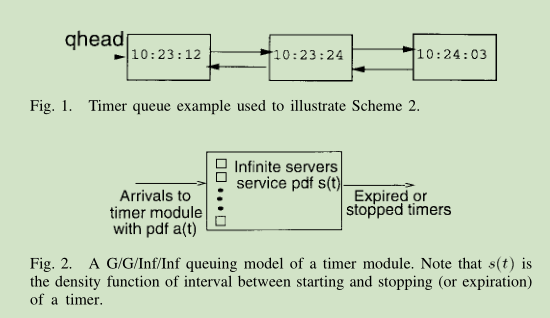
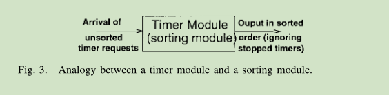
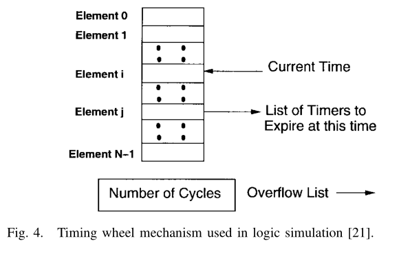
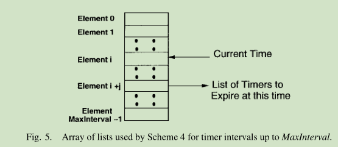
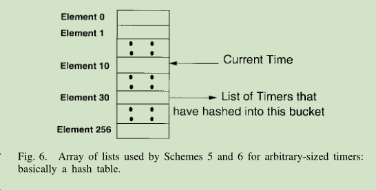
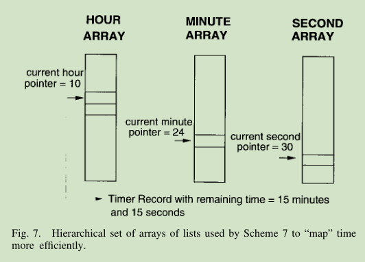

# Hashed and Hierarchical Timing Wheels: Efficient Data Structures for Implementing a Timer Facility（多层次的哈希时间轮：实现计时器功能的高效数据结构）
作者：George Varghese and Anthony Lauck

##### 
Abstract— The performance of timer algorithms is crucial to many network protocol implementations that use timers for failure recovery and rate control.  
Conventional algorithms to implement an Operating System timer module take O(n) time to start or maintain a timer, 
where n is the number of outstanding timers: this is expensive for large n.   
This paper shows that by using a circular buffer or timing wheel, it takes O(1) time to start, stop, and maintain timers within the range of the wheel.
摘要- 在很多使用计时器来实现故障恢复和速率控制的网络协议中，计时器算法的性能是非常关键的。
用于实现操作系统计时器模块的常规算法需要花费O(n)的时间复杂度用于启动或者维护一个计时器，n是待完成的计时器对象个数：对于一个很大的n值其开销是巨大的。  
本篇论文展示了通过使用一个环形缓冲器或时间轮，只需要O(1)的时间复杂度便可做到启动、停止和维护一个在当前时间轮范围内的计时器。  

#####
Two extensions for larger values of the interval are described.  
In the first, the timer interval is hashed into a slot on the timing wheel.  
In the second, a hierarchy of timing wheels with different granularities is used to span a greater range of intervals.
The performance of these two schemes and various implementation tradeoffs are discussed.
We have used one of our schemes to replace the current BSD UNIX callout and timer facilities.
Our new implementation can support thousands of outstanding timers without much overhead.
Our timer schemes have also been implemented in other operating systems and network protocol packages.
这里描述了对于支持更大范围区间的两方面拓展。  
首先，计时器的区间被哈希映射到时间轮的一个插槽中。其次，一个具有不同粒度的、具有层次性的时间轮能够拓展支持更大的区间。  
这里讨论了两种方案的性能以及不同实现方式的取舍。  
我们已经使用一种我们的方案来替换当前BSD-UNIX操作系统的UNIX调用和计时器设施。  
我们的新实现可以支持数以千计的待完成的计时器而没有额外的开销。  
我们的计时器实现方案也已经在其它的操作系统和网络协议包中被实现了。  

### I. INTRODUCTION（介绍）
#####
In a centralized or distributed system, we need timers for the following.
在一个中心化的或者分布式的系统中，我们需要以下所展示的计时器。  

#####
Failure Recovery: Several kinds of failures cannot be detected asynchronously.   
Some can be detected by periodic checking (e.g., memory corruption) and such timers always expire.   
Other failures can only be inferred by the lack of some positive action (e.g., message acknowledgment) within a specified period.   
If failures are infrequent, these timers rarely expire.  
故障恢复：少数几种无法被异步检查的故障。其中一些可以被周期性的检查所发现（例如内存损坏memory corruption），并且这些计时器总是会过期。  
其它故障的检测只能通过在一个指定的周期内缺乏某些积极的动作（比如消息确认）来推测。如果故障很少发生，则这些计时器也几乎不会过期

#####
Algorithms in Which the Notion of Time or Relative Time is Integral: 
Examples include algorithms that control the rate of production of some entity (process control, rate-based flow control in communications), 
scheduling algorithms, and algorithms to control packet lifetimes in computer networks.
These timers almost always expire.
关于时间或相对时间的概念是属于积分算法的：
例如包括一些实体生产速率的控制算法（过程控制，通信中基于速度的流量控制），调度算法以及控制计算机网络中数据包存活时间的算法。  
而这些计时器几乎总是会过期的。

#####
The performance of algorithms to implement a timer module becomes an issue when any of the following are true.
* The algorithm is implemented by a processor that is interrupted each time a hardware clock ticks, and the interrupt overhead is substantial.
* Fine granularity timers are required.
* The average number of outstanding timers is large.
当以下任意一项为真时，实现计时器模块的算法就会有性能问题
* 该算法由一个处理器实现，该处理器在每次硬件时钟tick时便被中断，其中断处理的开销是巨大的
* 需要非常细粒度的计时器
* 待完成的计时器平均数量非常大

#####
If the hardware clock interrupts the host every tick, and the interval between ticks is in the order of microseconds, 
then the interrupt overhead is substantial. 
Most host operating systems offer timers of coarse (milliseconds or seconds) granularity.
Alternately, in some systems finer granularity timers reside in special-purpose hardware. 
In either case, the performance of the timer algorithms will be an issue as they determine the latency incurred in starting 
or stopping a timer and the number of timers that can be simultaneously outstanding.
如果每一次硬件时钟tick都会中断主机，且每次tick的间隔在微秒级别，那么中断的开销就会是巨大的。  
大多数的主机操作系统提供的计时器通常是在毫秒或者秒级粒度的。或者，在一些系统中更细粒度的计时器则由专门的硬件实现。  
在任一一种情况下，计时器算法的性能都将是一个问题，因为他们决定了启动或者停止一个计时器的延迟以及可以同一时刻下可维持的待完成计时器的数量。

#####
As an example, consider communications between members of a distributed system. 
Since messages can be lost in the underlying network, timers are needed at some level to trigger retransmissions. 
A host in a distributed system can have several timers outstanding. 
Consider, for example, a server with 200 connections and 3 timers per connection.
Further, as networks scale to gigabit speeds, both the required resolution and the rate at which timers are started and stopped will increase.
Several recent network implementations have been tuned to send packets at a rate of 25000–40000 packets per second.
举个例子，考虑到分布式系统中各个成员间的通信。  
由于在底层网络中消息可能丢失，因此需要某种粒度级别的计时器来触发(消息)重传。一个位于分布式系统下的主机会有几个待完成的计时器。  
举个例子，考虑到一个有200个连接的服务器，其中每个连接对应3个计时器。
此外，随着网络速率达到GB级别，每一个计时器所需的时间粒度和启动、停止的速度要求都会增加。最近的几个网络实现其发送数据包的速率已经被调整为每秒25000-40000了。

#####
Some network implementations (e.g., the BSD TCP implementation) do not use a timer per packet; 
instead, only a few timers are used for the entire networking package.
The BSD TCP implementation gets away with two timers because the TCP implementation maintains its own timers for all outstanding packets, 
and uses a single kernel timer as a clock to run its own timers. 
TCP maintains its packet timers in the simplest fashion: whenever its single kernel timer expires,
it ticks away at all its outstanding packet timers. 
For example, many TCP implementations use two timers: a 200-ms timer and a 500-ms timer.
一些网络实现（例如BSD操作系统的TCP实现）不会为每个数据包都创建对应的计时器；取而代之的是，整个网络包只使用少量的计时器。
BSD的TCP实现只使用了两个计时器，因为tcp实现中为每一个未完成的数据包维护了一个计时器，并且使用单独的一个内核计时器来做为时钟来运行这些计时器。  
TCP以最简单的方式维护数据包的计时器：当单独的内核计时器过期了，便tick推进每一个待完成数据包的计时器。  
举个例子，很多tcp实现使用两个计时器：一个200ms粒度的计时器和一个500ms粒度的计时器。

#####
The naive method works reasonably well if the granularity of timers is low and losses are rare. 
However, it is desirable to improve the resolution of the retransmission timer to allow speedier recovery.
For example, the University of Arizona has a new TCP implementation called TCP Vegas that performs better than the commonly used TCP Reno. 
One of the reasons TCP Reno has bad performance when experiencing losses is the coarse granularity of the timeouts.
如果计时器的粒度比较低且丢包次数很少，则朴素的方法能够比较好的工作。然而，存在希望改进重传计时器粒度的以允许更快恢复(丢包故障)的需求。
举个例子，亚利桑那大学发明的被称作TCP Vegas的新TCP实现其性能就优于常用的TCP Reno实现。
TCP Reno在遇到丢包时性能不佳的原因之一就是控制超时重传的时间粒度太粗。 

#####
Besides faster error recovery, fine granularity timers also allow network protocols to more accurately measure small intervals of time. 
For example, accurate estimates of round trip delay are important for the TCP congestion control algorithm 
and the Scalable Reliable Multicast (SRM) framework that is implemented in the Wb conferencing tool.
Finally, many multimedia applications routinely use timers, and the number of such applications is increasing.
An example can be found in Siemens’ CHANNELS run time system for multimedia 
where each audio stream uses a timer with granularity that lies between 10 and 20 ms. 
For multimedia and other real-time applications, it is important to have worst-case bounds on the processing time to start and stop timers.
除了更快的错误恢复，更细粒度的计时器也允许网络协议能以更小的时间间隔进行更准确地测量。  
举个例子，准确地测量（通信）往返延迟对于TCP拥塞控制算法和基于可拓展的可靠广播框架(SRM)实现的Wb会议工具是很重要的。  
最后，很多多媒体应用通常都使用了计时器，且这些应用的数量正在增加。  
西门子的CHANNELS多媒体运行时系统中可以找到一个案例，其中每个音频流使用一个10到20毫秒粒度的计时器。  
对于多媒体和其它的实时应用程序，对计时器启动和停止处理的耗时下限进行限制是很重要的。  

#####
Besides networking applications, process control 
and other real-time applications will also benefit from large numbers of fine granularity timers.
Also, the number of users on a system may grow large enough to lead to a large number of outstanding timers.
This is the reason cited (for redesigning the timer facility) by the developers of the IBM VM/XA SP1 operating system.
处理网络应用程序，控制处理和其它的实时应用程序也受益于大量细粒度的计时器。  
此外，系统中的用户数量可能会大幅增长而导致同时存在大量待完成的计时器。  
这就是IBM VM/XA SP1操作系统的开发者们提出要重新设计计时器功能的原因。

#####
In the following sections, we will describe a family of schemes for efficient timer implementations 
based on a data structure called a timing wheel.
We will also describe performance results based on a UNIX implementation, 
and survey some of the systems that have implemented timer packages based on the ideas in this paper.
在下面的章节中，我们将讨论一系列基于一种被称作时间轮的数据结构而实现高性能计时器的方案。  
我们还将描述基于UNIX实现的性能成果，同时调查了其它的一些基于本篇博客思路来实现计时器包的系统。  

### II Model(模型)
Our model of a timer module has the following four component routines.
我们的计时器模块的模型包含了4个程序(例程 routines)组件。

#####
**START TIMER (Interval, RequestId, ExpiryAction):**   
The client calls this routine to start a timer that will expire after “Interval” units of time. 
The client supplies a RequestId which is used to distinguish this timer from other timers that the client has outstanding. 
Finally, the client can specify what action must be taken on expiry: 
for instance, calling a client-specified routine, or setting an event flag.
启动计时器(Interval 间隔，RequestId 请求id，ExpiryAction 计时器过期时的要做的操作)：
客户端调用启动计时器的例程，该计时器将在(参数)“间隔”单位时间后到期。  
客户端提供一个请求id用于区分该计时器和客户端其它待完成的计时器。  
最后，客户端可以指定计时器到期时必须执行的操作：例如调用一个客户端指定的例程或者设置一个事件标识。  

#####
**STOP TIMER (RequestId):**
This routine uses its knowledge of the client and RequestId to locate the timer and stop it.
停止计时器(RequestId 请求id)：
这个例程使用客户端和请求id来定位对应的计时器并且停止它。

#####
**PER TICK BOOKKEEPING :**
Let the granularity of the timer be T units. 
Then every units this routine checks whether any outstanding timers have expired; 
if this is the case, it calls STOP TIMER , which in turn calls the next routine.
记录每次时钟滴答：
让计时器的粒度为T个单位。
然后让该例程检查每个单位下是否有待完成的计时器已经过期；如果是这种情况，该例程将调用STOP TIMER，并依次调用下一个例程。

#####
**EXPIRY PROCESSING** : 
This routine does the ExpiryAction specified in the START TIMER call.
这个例程执行START TIMER调用时指定的ExpiryAction操作。

#####
The first two routines are activated on client calls while the last two are invoked on timer ticks.
The timer is often an external hardware clock.
前两个例程在客户端调用时被激活，而后两个则在计时器滴答(ticks)时被调用。  
计时器通常是一个外部的硬件时钟。

#####
The following two performance measures can be used to choose between the various algorithms described in the rest of this paper. 
Both of them are parameterized by , the average(or worst-case) number of outstanding timers.
以下两种性能测试的方法可以被用于在本篇论文剩余部分所描述的一系列算法。
这两种方法都以待完成计时器的平均数量(或者最坏场景下的数量)作为参数。

#####
1. **Space**: The memory required for the data structures used by the timer module
2. **Latency**: The time between the invoking of a routine in the timer module and its completion, 
   assuming that the caller of the routine blocks until the routine completes.
   Both the average and worst case latency are of interest. 

#####
1. 空间：计时器模块所使用数据结构所需的内存
2. 延迟：调用计时器模块例程到其完成的时间间隔，假设例程的调用者将被阻塞直到例程完成。
   其平均延迟和最坏情况下的延迟同样重要。

#####
For example, a client application that implements a transport protocol may find 
that space is cheap and the critical parameters for each routine in the timer module are as shown in Table I.  
举个例子，一个实现了传输协议的客户端程序可以发现其内存开销很低，而且计时器模块中每个例程的关键参数都展示在表I中

#####
The performance measures important for the client applications should be used to choose among timer algorithms.
在选择计时器算法时，性能测试是非常重要的。

### III. EXISTING TIMER SCHEMES(已经存在的计时器方案)
#####
A. Scheme 1—Straightforward(方案1-直接了当的)
#####
Here START TIMER finds a memory location and sets that location to the specified timer interval. 
Every units, PER TICK BOOKKEEPING will decrement each outstanding timer;
if any timer becomes zero, EXPIRY PROCESSING is called.
START TIMER找到一块内存并且设置特定的计时器时间间隔。
每一个单位时间，PER TICK BOOKKEEPING将会减少每一个待完成计时器的值，如果任一计时器被减为0，则调用EXPIRY PROCESSING。

#####
This scheme is extremely fast except for per tick bookkeeping. 
It also uses one record per outstanding timer, the minimum space possible. 
Its performance is summarized in Table II. It is appropriate if:
* there are only a few outstanding timers;
* most timers are stopped within a few ticks of the clock;
* PER TICK BOOKKEEPING is done with suitable performance by special-purpose hardware.

除了每次tick时都需要记录之外，这个方案非常的快。  
它也为每一个待完成的计时器都使用一个记录，空间开销也可能是最小的。
表II总结了其性能: 如果满足以下条件该方案将是合适的：
* 只有少数的几个待完成的计时器
* 绝大多数计时器会在少数的几个tick内停止(完成)
* 通过专门的硬件以合理的性能完成PER TICK BOOKKEEPING

#####
Note that instead of doing a Decrement, we can store the absolute time at which timers expire and do a Compare.
This option is valid for all timer schemes we describe; 
the choice between them will depend on the size of the time-of-day field,
the cost of each instruction, and the hardware on the machine implementing these algorithms.
In this paper we will use the Decrement option, except when describing Scheme 2.
请注意，我们可以存储计时器的绝对过期时间来(与当前时间)进行比较来代替递减。
这个选项适用于我们所描述的所有计时器方案；
两种选项如何选择取决于时间字段的大小，每条指令的成本以及实现这些算法的机器硬件。
在本文中，除了方案2，我们都将使用递减的选项。

#####
B. Scheme 2—Ordered List(方案2-有序列表)
Here PER TICK BOOKKEEPING latency is reduced at the expense of START TIMER performance. 
Timers are stored in an ordered list. 
Unlike Scheme 1, we will store the absolute time at which the timer expires, and not the interval before expiry.
该方案中，PER TICK BOOKKEEPING的延迟降低是以START TIMER的性能为代价的。  
计时器被存储在一个有序列表中。
与方案1不同，我们将存储计时器过期的绝对时间，而不是过期前的间隔。

#####
The timer that is due to expire at the earliest time is stored at the head of the list. 
Subsequent timers are stored in increasing order as shown in Fig. 1
最早到期的计时器被存储再列表的头部。
后续的计时器以到期时间升序排序存储在列表中，如图1所示。

#####
In Fig. 1, the lowest timer is due to expire at absolute time 10 h, 23 min, and 12 s.
在图1中，最小的计时器将在绝对时间10小时，23分钟，12秒时过期。

#####
Because the list is sorted, PER TICK BOOKKEEPING need only increment the current time of day, and compare it with the head of the list. 
If they are equal, or the time of day is greater, it deletes that list element and calls EXPIRY PROCESSING . 
It continues to delete elements at the head of the list until the expiry time of the head of the list is strictly less than the time of day.
由于列表是有序的，PER TICK BOOKKEEPING只需要增加当前的时间，并且用其与列表头部的计时器进行比较。  
如果他们相等，或者当前时间更大，则删除列表中的元素并且调用EXPIRY PROCESSING。  
其继续删除列表头部的元素(并调用EXPIRY PROCESSING)，直到列表头部元素的过期时间严格的小于当前时间。  

#####
START TIMER searches the list to find the position to insert the new timer.
In the example, START TIMER will insert a new timer due to expire at 10:24:01 between the second and third elements.
START TIMER对列表进行搜索以找到新计时器插入的位置。
在本例中，START TIMER将一个过期时间为10:24:01的新计时器，插入到第二个和第三个元素之间。

#####
The worst-case latency to start a timer is O(n). 
The average latency depends on the distribution of timer intervals (from time started to time stopped), 
and the distribution of the arrival process according to which calls to START TIMER are made.
启动一个计时器的延迟在最坏情况下为O(n)。
平均的延迟取决于计时器间隔的分布(从开始时间到停止时间)，以及根据调用START TIMER所依据的到达过程的分布。
（todo 好抽象，没翻译好。。。）

#####
Interestingly, this can be modeled (Fig. 2) as a single queue with infinite servers; 
this is valid because every timer in the queue is essentially decremented (or served) every timer tick.
It is shown in, that we can use Little’s result to obtain the average number in the queue; 
also the distribution of the remaining time of elements in the timer queue seen by a new request is the residual life density 
of the timer interval distribution.
有趣的是，这些可以被建模为一个有着无限服务器的单条队列，
这是可行的，因为队列中的每一个计时器本质上都会在每一个计时器tick中递减(或提供服务)。  
如展示的那样，我们可以使用Little的结果来获得队列中的平均数；也能由一个新请求中计时器剩余寿命的密度间隔分布看到在计时器队列中元素的剩余时间分布。
（抽象。。。）

#####
If the arrival distribution is Poisson, the list is searched from the head, and reads and writes both cost one unit, 
then the average cost of insertion for negative exponential and uniform timer interval distributions is shown into be
如果到达的分布符合泊松分布，从列表头部的搜索以及读取和写入都花费一个单位，  
则负指数分布下的平均插入耗时和均匀的计时器间隔分布如下所示：

#####
Results for other timer interval distributions can be computed using a result in. 
For a negative exponential distribution we can reduce the average cost to 2+n/3 by searching the list from the rear. 
In fact, if timers are always inserted at the rear of the list, this search strategy yields an O(1) START TIMER latency. 
This happens, for instance, if all timers intervals have the same value. 
However, for a general distribution of the timer interval, we assume the average latency of insertion is O(n).
其它计时器间隔的分布的结果可以被用来计算该结果。  
对于负指数的分布，通过从后面搜索列表我们可以将平均耗时减少到2+n/3。
事实上，如果计时器总是被插入在列表后端，START TIMER在该搜索策略下会产生O(1)的延迟。  
例如，如果所有的计时器都具有相同的时间间隔。
然而，对于一个常规的计时器间隔分布，我们假设平均的插入延迟为O(n)。

#####
STOP TIMER need not search the list if the list is doubly linked. 
When START TIMER inserts a timer into the ordered list, it can store a pointer to the element. 
STOP TIMER can then use this pointer to delete the element in O(1) time from the doubly linked list. 
This can be used by any timer scheme.
如果链表是双向链表，则STOP TIMER将不需要进行搜索。
当START TIMER项有序列表插入一个计时器时，它可以存储该元素的一个指针。
STOP TIMER可以使用这个指针以O(1)的时间复杂度从双向链表中删除该元素。
这(个技巧)可以被任何计时器(实现)方案所使用。

#####
If Scheme 2 is implemented by a host processor, the interrupt overhead on every tick can be avoided 
if there is hardware support to maintain a single timer. 
The hardware timer is set to expire at the time at which the timer at the head of the list is due to expire. 
The hardware intercepts all clock ticks and interrupts the host only when a timer actually expires.
Unfortunately, some processor architectures do not offer this capability.
Algorithms similar to Scheme 2 are used by both VMS and UNIX in implementing their timer modules. 
The performance of the two schemes is summarized in Table II.
如果方案2是由主机处理器实现的，那么如果有硬件来支持和维护一个单独的计时器则可以避免每一次tick时的中断开销。  
硬件计时器被设置为在列表头部的计时器过期时，到期。
硬件拦截所有的时钟tick并且只在计时器到期时中断主机。
不幸的是，一些处理器架构并没有提供这一功能。
VMS和UNIX操作系统在实现他们的计时器模块时都使用了类似方案2的算法。
表II总结了这两种方案的性能。

#####
As for Space, Scheme 1 needs the minimum space possible;
Scheme 2 needs extra space for the forward and back pointers between queue elements.  
对于空间使用上，方案1所需要的空间尽可能的少；方案2则需要额外的空间用于(维护)队列元素之间的前向、后向指针。

### IV. SORTING TECHNIQUES AND TIME-FLOW MECHANISMS（排序技术和时间流机制）  
**A. Sorting Algorithms and Priority Queues（排序算法和优先级队列）**
#####
Scheme 2 reduced PER TICK BOOKKEEPING latency at the expense of START TIMER by keeping the timer list sorted.
Consider the relationship between timer and sorting algorithms depicted in Fig. 3. However, consider the following.  
方案2通过保持计时器列表的有序性，以START TIMER为代价(注：START TIMER更加耗时了，因为需要有序)来减少PER TICK BOOKKEEPING的延迟。  
考虑到图3中计时器和排序算法之间的关系。然而考虑以下情况。

#####
*  In a typical sort, all elements are input to the module when the sort begins;the sort ends by outputting all elements in sorted order.
   A timer module performs a more dynamic sort because elements arrive at different times and are output at different times.
*  In a timer module, the elements to be “sorted” change their value over time if we store the interval. 
   This is not true if we store the absolute time of expiry.  

*  在典型的排序中，当排序开始时所有的元素作为模块的输入；排序结束时按照排序的顺序输出所有的元素。
   计时器模块使用一种更加动态的排序，因为元素是在不同时间点到来的并且其也在不同的时间点被输出。
*  在计时器模块中，如果我们存储(时间)间隔,则要被排序的元素会随着时间而改变它们的值。
   如果我们存储了(计时器)过期的绝对时间，则没这个问题。

#####
A data structure that allows “dynamic” sorting is a priority queue. 
A priority queue allows elements to be inserted and deleted; it also allows the smallest element in the set to be found. 
A timer module can use a priority queue, and do PER TICK BOOKKEEPING only on the smallest timer element.  
一种允许动态排序的数据结构就是优先级队列。
一个优先级队列允许元素被插入和删除；也允许找到集合中最小的元素。
一个计时器模块可以使用优先级队列，并且只在最小的计时器元素上执行PER TICK BOOKKEEPING。

#####
* Scheme 3—Tree-Based Algorithms: A linked list(Scheme 2) is one way of implementing a priority queue. For large n, tree-based data structures are better. 
  These include unbalanced binary trees, heaps, post-order and end-order trees, and leftist-trees. 
  They attempt to reduce the latency in Scheme 2 for START TIMER from to O(n) to O(log n).
  In it is reported that this difference is significant for large , and that unbalanced binary trees are less expensive than balanced binary trees. 
  Unfortunately, unbalanced binary trees easily degenerate into a linear list; this can happen, for instance, if a set of equal timer intervals are inserted.  

* 方案3-基于树的算法：链表(方案2)是一种实现优先级队列的方案。当n值很大时，基于树的数据结构会更优秀。
  这其中包括了非平衡二叉树，堆，后序树和末序树，以及左树。
  它们试图将方案2中START TIMER的延迟从O(n)减少到O(log n)。
  据说在大规模（元素存储）时差异是显著的，并且非平衡的二叉树的开销要低于自平衡二叉树。
  不幸的是，非平衡的二叉树很容易退化为线性表；例如，如果插入一组相同时间间隔的计时器时就会发生这种情况。
#####
We will lump these algorithms together as Scheme 3:tree-based algorithms. 
The performance of Scheme 3 is summarized in Table II.  
我们将这些算法汇总为方案3：基于树的算法。
表II中总结了方案3的性能。

#####
**B. Discrete Event Simulation(离散事件模拟)**  
In discrete event simulations, all state changes in the system take place at discrete points in time. 
An important part of such simulations are the event-handling routines or time-flow mechanisms. 
When an event occurs in a simulation, it may schedule future events. 
These events are inserted into some list of outstanding events. 
The simulation proceeds by processing the earliest event, which in turn may schedule further events. 
The simulation continues until the event list is empty or some condition (e.g., clock MaxSimulationTime) holds.    
在离散的事件模拟中，系统中所有的状态变化都发生在离散的时间点上。  
此类模拟的一个重要部分时事件处理例程或时间流机制。
当模拟中一个事件发生时，可能会对未来的事件进行调度。
这些事件会被插入到一些待完成事件的列表中。
通过处理最早的事件来执行模拟，这样可以依次调度进一步的事件。
模拟将一直持续直到事件列表为空或者某些条件成立(例如时钟到达了最大模拟时间)。

#####
There are two ways to find the earliest event and update the clock.
1. The earliest event is immediately retrieved from some data structure (e.g., a priority queue) and the clock jumps to the time of this event. 
   This is embodied in simulation languages like GPSS and SIMULA.
2. In the simulation of digital circuits, it is often sufficient to consider event scheduling at time instants that are multiples of the clock interval, say _c_. 
   Then, after the program processes an event, it increments the clock variable by _c_ until it finds any outstanding events at the current time. 
   It then executes the event(s). This is embodied in languages for digital simulation like TEGAS and DECSIM.  
#####
这里有两种方法可以找到最早的事件并且更新时钟。
1. 从某些数据结构中立即检索出最早的事件(例如一个优先级队列)，并且时钟跳转到这一事件的时间上。
   这在像GPSS和SIMULA等模拟语言中得以体现。
2. 在数字电路的模拟中，只需要考虑事件调度瞬时时间点作为时钟间隔倍数就足够了，例如 _c_。
   然后，在程序处理了一个事件后，时钟变量增加c，直到当前时间下找到任意的待完成事件。然后执行这些事件(一至多个事件)。
   这在像TEGAS和DECSIM等数字模拟语言中得以体现。

#####
We have already seen that algorithms used to implement the first method are applicable for timer algorithms: these include linked lists and tree-based structures. 
What is more interesting is that algorithms for the second method are also applicable. 
Translated in terms of timers, the second method for PER TICK BOOKKEEPING is: “Increment the clock by the clock tick. 
If any timer has expired, call EXPIRY PROCESSING .”   
我们已经看到，适用于第一种方法来实现计时器的算法：这些算法包括（使用）链表和基于树的结构。  
更有趣的是，这些算法也同样适用于第二种方法。
以计时器中(的语义)来翻译,第二种方法(实现)PER TICK BOOKKEEPING：“按照时钟tick来递增时钟，如果任意计时器过期了，则调用EXPIRY PROCESSING。”

#####
An efficient and widely used method to implement the second method is the so-called timing-wheel technique.
In this method, the data structure into which timers are inserted is an array of lists, with a single overflow list for timers beyond the range of the array.  
一种以第二种方法实现(计时器)的，有效且被广泛使用的方式就是所谓的时间轮技术。  
在这种方法中，计时器被插入到一个基于数组的列表数据结构中，对于超出数组范围的计时器则只有一个溢出列表。

#####
In Fig. 4, time is divided into cycles; each cycle is N units of time.
Let the current number of cycles be S. 
If the current time pointer points to element i, the current time is S * N + i.
The event notice corresponding to an event scheduled to arrive within the current cycle (e.g., at time S * N + j, for integer j between 0 and n) 
is inserted into the list pointed to by the jth element of the array.
Any event occurring beyond the current cycle is inserted into the overflow list. 
Within a cycle, the simulation increments the current time until it finds a nonempty list; it then removes and processes all events in the list. 
If these schedule future events within the current cycle, such events are inserted into the array of lists; 
if not, the new events are inserted into the overflow list.  
在图4中，时间以周期的方式被划分，每个周期为N个时间单位。假设当前的周期为S。
如果当前时间指针指向元素i，则当前时间为S * N + i。  
计划在当前周期内被调度的事件都会得到对应的事件通知，(例如，计划在S * N + j时被调度的计时器，其中j大于0小于N)会被插入到数组中第j个元素所指向的列表中。
在当前周期之外的任意事件都将会被插入到溢出列表中。
在一个周期内，会模拟的增加当前时间直到找到一个非空列表。然后删除并处理这个列表中的所有事件。
如果未来需要被调度的事件处于当前周期，这些事件将会被插入到当前数组的列表中。如果新的事件不处于当前周期，则将会被插入到溢出列表中。

#####
The current time pointer is incremented modulo N. 
When it wraps to 0, the number of cycles is incremented, and the overflow list is checked; 
any elements due to occur in the current cycle are removed from the overflow list and inserted into the array of lists.
This is implemented in TEGAS-2.  
当前时间指针以N为模递增。  
当它为0时(求模的值是一个环形)，周期的值将会增加，然后检查溢出列表；位于当前周期内的所有元素都将被从溢出列表中移除，并插入到数组对应的列表中。

#####
The array can be conceptually thought of as a timing wheel; 
every time we step through locations, we rotate the wheel by incrementing the number of cycles.
A problem with this implementation is that as time increases within a cycle and we travel down the array, 
it becomes more likely that event records will be inserted in the overflow list. 
Other implementations reduce (but do not completely avoid) this effect by rotating the wheel half-way through the array.  
这个数组在概念上可以认为是一个时间轮。
每次我们的通过一个位点时，我们通过增加周期数来旋转这个轮子。
这种实现的一个问题在于随着时间跟着周期增加，我们沿着数组向下推进，事件记录更有可能被插入到溢出列表中。
其它的实现通过旋转轮子至数组的一半来减少这种影响(并没有完全避免)。

#####
In summary, we note that time flow algorithms used for digital simulation can be used to implement timer algorithms;
conversely, timer algorithms can be used to implement time flow mechanisms in simulations.
However, there are differences to note.  
总之，我们注意到使用数字模拟的时间流算法可以被用于实现计时器算法；相对的，计时器算法可以被用来实现模拟的时间流机制。
然而，这里有一些不同需要注意。

#####
* In digital simulations, most events happen within a short interval beyond the current time. 
  Since timing wheel implementations rarely place event notices in the overflow list, they do not optimize this case.
  This is not true for a general-purpose timer facility.
* Most simulations ensure that if two events are scheduled to occur at the same time,
  they are removed in FIFO order. Timer modules need not meet this restriction.
* Stepping through empty buckets on the wheel represents overhead for a digital simulation. 
  In a timer module, we have to increment the clock anyway on every tick.
  Consequently, stepping through empty buckets on a clock tick does not represent significant extra overhead 
  if it is done by the same entity that maintains the current time.
* Simulation languages assume that canceling event notices is very rare. 
  If this is so, it is sufficient to mark the notice as “canceled” and wait until the event is scheduled; at that point, the scheduler discards the event. 
  In a timer module, STOP TIMER may be called frequently; 
  such an approach can cause the memory needs to grow unboundedly beyond the number of timers outstanding at any time.  
#####
* 在数字模拟中，大多数事件都发生在当前事件之后的短时间间隔中。
  由于时间轮的实现很少在溢出列表中发布事件通知，因此没有对这种情况进行优化。
  而对于多功能的计时器设施情况并非如此。
* 大多数模拟确保两个需要在相同时间被调度的时间，它们会按照先进先出的顺序被移除。而计时器模块不需要理会这个限制。
* 单步执行轮子上的空桶来表示数字模拟的开销。
  在计时器模块中，我们必须在每次tick时增加时钟。
  因此，如果在同一个实体上维护当前时间，则在时钟tick时单步的执行空桶并不会产生显著的额外开销。
* 模拟语言假设取消事件通知是不常见的。
  如果是这样，那么将通知标记为"已取消"并且等待其被调度就足够了，(被取消的事件)被调度时调度器将将丢弃该事件。
  在计时器模块中，STOP TIMER可能会被频繁的调用;(上述)这样的方法可能会导致所需的内存无限制的增长，在任何时候都超过了待完成计时器的数量。

#####
We will use the timing-wheel method below as a point of departure to describe further timer algorithms.  
我们将以下面的时间轮(实现)方法作为出发点来进一步讨论计时器算法。

### V. SCHEME 4—BASIC SCHEME(方案4-基础方案)
We describe a simple modification of the timing-wheel algorithm. 
If we can guarantee that all timers are set for periods less than MaxInterval, 
this modified algorithm takes O(1) latency for START TIMER, STOP TIMER, and also for PER TICK BOOKKEEPING.
Let the granularity of the timer be 1 unit. 
The current time is represented in Fig. 5 by a pointer to an element in a circular buffer with dimensions [0, MaxInterval-1].  
我们描述对于时间轮算法的一个简单修改。
如果我们可以保证所有的计时器的时间段都设置为小于MaxInterval，那么修改后的算法可以做到以O(1)延迟的START TIMER，STOP TIMER以及PER TICK BOOKKEEPING。
假设计时器的粒度为1个单位。
图5中的当前时间由指向维度为[0, MaxInterval-1]的环形缓冲区中某一元素的指针所表示。

#####
To set a timer at j units past current time, we index (Fig. 5)into Element i + j (mod MaxInterval), 
and put the timer at the head of a list of timers that will expire at a time = Current Time + j units.
Each tick we increment the current timer pointer(mod MaxInterval) and check the array element being pointed to. 
If the element is 0 (no list of timers waiting to expire), no more work is done on that timer tick.
But if it is nonzero, we do expiry processing on all timers that are stored in that list.
Thus, the latency for START TIMER is O(1). 
The cost of PER TICK BOOKKEEPING is O(1) except when timers expire, but this is the best possible. 
If the timer lists are doubly linked, and, as before, we store a pointer to each timer record, then the latency of STOP TIMER is also O(1).  
为了将计时器设置到超过当前时间j个单位，我们索引到(图5)元素i+j(mod MaxInterval)，并将计时器放在计时器列表的头部，该计时器将在当前时间+j个单位后到期。  
每次tick时，我们增加当前时间的指针(mod MaxInterval)并检查所指向的数组元素。
如果元素个数为0(没有等待过期的计时器列表)，在当前计时器tick中不再执行更多的工作。
但如果元素个数不为0，我们将会对存储在列表中的所有计时器执行过期时的处理操作。
因此，START TIMER的延迟为O(1)。
除非有计时器过期了，否则PER TICK BOOKKEEPING的耗时也为O(1),但这已经是最好的了。
如果计时器列表是双向链接的，并且在此之前我们存储了每一个计时器记录的指针，则STOP TIMER的延迟也是O(1)。

#####
This is basically a timing-wheel scheme where the wheel turns one array element every timer unit, 
as opposed to rotating every MaxInterval or MaxInterval/2 units. 
This guarantees that all timers within MaxInterval of the current time will be inserted in the array of lists; 
this is not guaranteed by conventional timing wheel algorithms.  
这是一种基础的时间轮粉干，其中在每个计时器单元中转动轮子中的一个数组元素，而不是每MaxInterval或者MaxInterval/2单元旋转一次。
这保证了所有位于当前时间到MaxInterval中的所有计时器都会被插入到数组的列表中，而传统的时间轮算法没有提供这种保证。
#####
In sorting terms, this is similar to a bucket sort that trades off memory for processing. 
However, since the timers change value every time instant, intervals are entered as offsets from the current time pointer. 
It is sufficient if the current time pointer increases every time instant.  
在排序方面，这类似于一个用内存来进行处理的桶排序。
然而，由于计时器在每个时间点都会改变其值，因此时间间隔将作为当前时间指针的偏移量输入。
当前时间指针在每一个时间点上都会增加，这就足够了。

#####
A bucket sort sorts N elements in O(M) time using M buckets, since all buckets have to be examined.
This is inefficient for large M > N. 
In timer algorithms, however, the crucial observation is that some entity needs to do O(1) work per tick to update the current time;
it costs only a few more instructions for the same entity to step through an empty bucket.
What matters, unlike the sort, is not the total amount of work to sort N elements, 
but the average (and worst-case) part of the work that needs to be done per timer tick.  
桶排序使用M个桶在O(M)的时间内对N个元素进行排序，因此所有的通都必须被检查。
对于M远大于N时，这是低效的。
然而在计时器算法中，观察的结果是一些实体需要在每次tick时执行O(1)的工作去更新当前时间;对于同一个实体来说只需要极少数的几条指令就能单步执行一个空桶。
与排序不同，重要的不是对N个元素排序的总工作量，而是每次计时器tick时所需要完成的平均(和最坏情况)的那部分工作量。

#####
Still memory is finite: it is difficult to justify 2^32 words of memory to implement 32 bit timers.
One solution is to implement timers within some range using this scheme and the allowed memory.
Timers greater than this value are implemented using, say, Scheme 2.
Alternately, this scheme can be extended in two ways to allow larger values of the timer interval with modest amounts of memory.  
静态内存是有限的：很难去证明2^32字节的内存能实现32位的计时器(注：指的应该是32位来标识绝对时间的计时器)。
一种解决方案是使用这个方案在所允许的内存内实现支持一定(时间)范围内的计时器。
大于此值的计时器使用方案2来实现。
或者，可以通过两种方式来拓展该方案以允许在合适的内存上支持更大时间间隔范围的计时器。

### VI. EXTENSIONS(拓展)
##### A. Extension 1—Hashing(拓展1-哈希)
The previous scheme has an obvious analogy to inserting an element in an array using the element value as an index. 
If there is insufficient memory, we can hash the element value to yield an index.  
前面的方案明显类似于以元素的值作为索引在数组中插入元素。
如果内存不足，我们可以对元素的值进行哈希后来生成索引。

#####
For example, if the table size is a power of 2, an arbitrary size timer can easily be divided by the table size; 
the remainder(low order bits) is added to the current time pointer to yield the index within the array. 
The result of the division (high order bits) is stored in a list pointed to by the index.  
举个例子，如果表的大小是2的幂，则可以很容易的将任意大小的计时器除以表的大小；
其中余数(低位)加上当前时间指针指向的索引以生成数组中的索引。
除法的结果(高位)存储到数组索引所指向的列表中。

#####
In Fig. 6, let the table size be 256 and the timer be a 32-bit timer. 
The remainder on division is the last 8 bits. 
Let the value of the last 8 bits be 20. 
Then the timer index is 10(Current Time Pointer) + 20 (remainder) = 30. 
The 24 high order bits are then inserted into a list that is pointed to by the 30th element.  
在图6中，表的大小为256并且计时器是32位的。
除法时的余数是后8位。
假设最后8位的值为20。则计时器的(对应的数组)索引为10(当前时间指针) + 20(余数) = 30
然后将高24位(的值)插入到第30位元素所指向的列表中。

#####
Other methods of hashing are possible. For example, any function that maps a timer value to an array index could be used. 
We will defend our choice at the end of this subsection. 
Next, there are two ways to maintain each list.  
其它的hash方法也是可行的。举个例子，可以用于将计时器映射到数组索引的任意函数(都是可行的)。
我们将在本小节的末尾来解释我们的选择。
接下来，有两种方式来维护每个列表。

#####
1. Scheme 5—Hash Table With Sorted Lists: Here each list is maintained as a ordered list exactly as in Scheme 2.
   START TIMER can be slow because the 24 bit quantity must be inserted into the correct place in the list. 
   Although the worst-case latency for START TIMER is still O(n), the average latency can be O(1). 
   This is true if n < TableSize, and if the hash function (which is TimerValue mod TableSize) distributes timer values uniformly across the table.
   If so, the average size of the list that the *i*th element is inserted into is i - 1/TableSize. 
   Since i <= n < TableSize, the average latency of START TIMER is O(1).
   How well this hash actually distributes depends on the arrival distribution of timers to this module, and the distribution of timer intervals.
  
   PER TICK BOOKKEEPING must increment the current time pointer. 
   If the value stored in the array element being pointed to is zero, there is no more work. 
   Otherwise, as in Scheme 2, the top of the list is decremented. 
   If the timer at the top of the list expires, EXPIRY PROCESSING is called and the top list element is deleted. 
   Once again, PER TICK BOOKKEEPING takes O(1) average and worst-case latency except 
   when multiple timers are due to expire at the same instant, which is the best we can do.  
#####
1. 方案5-有着有序列表的哈希表：这里每一个列表都以有序列表的形式来维护，与方案2中的一模一样。
   由于必须将24位数量级(数据)插入到列表中正确的位置，START TIMER可能会很慢。
   尽管START TIMER的最坏情况下的延迟是O(n)，但其平均延迟可以是O(1)。
   如果n < TableSize，并且哈希函数能将计时器均匀的分布在表中则(上述情况)是真的。
   如果是这样的话，则第i个元素插入时列表的平均长度为(i - 1)/TableSize。
   由于i <= n < TableSize, 则START TIMER的平均延迟为O(1)。
   哈希实际分布的有多好取决于计时器到达这个模块的分布，以及计时器间隔的分布。

   PER TICK BOOKKEEPING必须递增当前时间指针。
   如果指针所指向数组元素所存储的值为0，则没有更多的工作要做。
   否则，如方案2，列表的头部将会减少。
   如果队列头部的元素过期了，EXPIRY PROCESSING将会被调用并且列表头部的元素将被删除。
   再一次，PER TICK BOOKKEEPING将得到O(1)的平均延迟和最坏延迟，除非多个计时器在同一时间点过期，这是我们所能做到的最好情况。
#####
Finally, if each list is doubly linked and START TIMER stores a pointer to each timer element, STOP TIMER takes O(1) time.  
最后，如果每一个链表都是双向连接的，并且START TIMER存储了每一个计时器元素的指针，则STOP TIMER花费O(1)的时间。

#####
A pleasing observation is that the scheme reduces to Scheme 2 if the array size is 1. 
In terms of sorting, Scheme 5 is similar to doing a bucket sort on the low order bits,
followed by an insertion sort on the lists pointed to by each bucket.  
令人满意的观察到如果数组的大小为1，则该方案会退缩为方案2。
在排序方面，方案5类似于对低位进行桶排序，接着对每个桶所指向的列表进行一次插入排序。

#####
2. Scheme 6—Hash Table with Unsorted Lists: If a worst-case START TIMER latency O(n) of is unacceptable, 
   we can maintain each time list as an unordered list instead of an ordered list. 
   Thus, START TIMER has a worst case and average latency of O(1). 
   But the per-tick bookkeeping now takes longer.
   Every timer tick, we increment the pointer (mod TableSize); 
   if there is a list there, we must decrement the high order bits for every element in the array, exactly as in Scheme 1.
   However, if the hash table has the property described above, then the average size of the list will be O(1).
#####
2. 方案6-有着无序列表的哈希表：如果START TIMER在最坏情况下的延迟O(n)是不可接受的，我们可以将每一个时间列表维护为无序列表，而不是有序列表。
   因此START TIMER的最坏情况和平均情况的延迟都是O(1)。
   但是per-tick bookkeeping现在需要花费更长的时间了。
   每一次计时器tick，我们递增指针(模上TableSize)；如果(对应索引处)存在一个列表，我们必须减少数组中每一个元素高位的bit，就和方案1一模一样。
   然而，如果哈希表具有以上所说的属性，则其列表的平均大小将会是O(1)。

#####
We can make a stronger statement about the average behavior regardless of how the hash distributes. 
Notice that every TableSize ticks we decrement once all timers that are still living.
Thus, for timers, we do n/TableSize work on average per tick. 
If n < TableSize then we do O(1) work on average per tick.
If all timers hash into the same bucket, then every TableSize ticks we do O(n) work, but for intermediate ticks we do O(1) work.  
无论哈希如何的分布，我们都可以对平均行为有一个强有力的论述。
注意到每TableSize次tick，我们会对所有存活的计时器进行一次递减。
因此，对于计时器，我们在每次tick时平均完成n/TableSize次的工作。
如果n < TableSize,则我们在每次tick时平均做O(1)的工作。
如果所有的计时器都被哈希到同一个桶，则每TableSize次tick我们做O(n)工作，但是对于中间的tick我们做O(1)的工作。

#####
Thus, the hash distribution in Scheme 6 only controls the variance of the latency of PER TICK BOOKKEEPING , and not the average latency. 
Since the worst-case latency of PER TICK BOOKKEEPING is always O(n)(all timers expire at the same time), 
we believe that the choice of hash function for Scheme 6 is insignificant.
Obtaining the remainder after dividing by a power of 2 is cheap, and consequently recommended.
Further, using an arbitrary hash function to map a timer value
into an array index would require PER TICK BOOKKEEPING to compute the hash on each timer tick, 
which would make it more expensive.
因此，方案6中的哈希分布只控制PER TICK BOOKKEEPING延迟的方差，而不控制平均的延迟。
由于最坏情况下PER TICK BOOKKEEPING的延迟总是O(n)(所有的计时器在相同的时间过期)，我们认为在方案6中哈希函数的选择是无关紧要的。
对于2次幂进行除法获取余数是便宜的(注：开销较小)，因此建议使用(注：TableSize的值设置为2次幂)。
此外，使用任意的哈希函数去映射计时器作为数组下标的值，会由于PER TICK BOOKKEEPING会在每次计时器tick计算哈希而变得更加昂贵。

#####
We discuss implementation strategies for Scheme 6 in Appendix A.  
我们在附录A中讨论了方案6的实现策略。   

##### B. Extension 2—Exploiting Hierarchy()
The last extension of the basic scheme exploits the concept of hierarchy.
To represent the number 1000000 we need only seven digits instead of 1000000 
because we represent numbers hierarchically in units of 1’s, 10’s, 100’s etc.
Similarly, to represent all possible timer values within a 32-bit range, we do not need a 2^32 element array. 
Instead we can use a number of arrays, each of different granularity.  
For instance, we can use four arrays as follows:  
* a 100-element array in which each element represents a day;
* a 24-element array in which each element represents an hour;
* a 60-element array in which each element represents a minute;
* a 60-element array in which each element represents a second.  

基础方案的最后一项拓展是利用了层次的概念。
为了表示数字1000000，我们只需要一个数字而不是1000000个数字，因为我们通过1、10、100等单位层次化的表示数字。
类似地，表示32位范围内的所有可能的计时器的值，我们不需要一个能包含2^32元素的数组。
相反，我们可以使用多个数组，每一个数组具有不同的粒度。  
例如，我们可以使用以下4个数组：
* 一个100元素的数组，其中每个元素代表1天
* 一个24元素的数组，其中每个元素代表1小时
* 一个60元素的数组，其中每个元素代表1分钟
* 一个60元素的数组，其中每个元素代表1秒钟

#####
Thus, instead of million locations 100 * 24 * 60 * 60 = 8.64million locations to store timers up to 100 days, 
we need only 100 + 24 + 60 + 60 = 244 locations.  
因此，我们可以只需要100 + 24 + 60 + 60 = 244个位置来存储100天内的计时器，而不是100 * 24 * 60 * 60 = 864万个位置。

#####
As an example, consider Fig. 7. Let the current time be 11 days, 10 h, 24 min, 30 s. 
Then to set a timer of 50 min and 45s, we first calculate the absolute time at which the timer will expire. 
This is 11 days, 11 h, 15 min, 15 s. 
Then we insert the timer into a list beginning 1 (11–10 hrs) element ahead of the current hour pointer in the hour array. 
We also store the remainder (15 min and 15 s) in this location.
We show this in Fig. 7, ignoring the day array which does not change during the example.  
例如图7,，假设当前时间为第11天的10点24分30秒。
然后设置一个在50分45s后过期的计时器，我们首先计算计时器过期的绝对时间，是第11天的11点15分15秒。
然后我们将计时器插入到在当前小时指针所在的小时数组的后1个(11-10小时)元素对应的列表中。
我们也存储余数(15分15秒)在这个位置。
我们在图7中展示了这一点，忽略了在这个例子中一直保持不变的日期数组。

#####
The seconds array works as usual: every time the hardware clock ticks, we increment the second pointer. 
If the list pointed to by the element is nonempty, we process all elements in the list using EXPIRY PROCESSING .
However, the other three arrays work slightly differently.  
秒数组正常工作：每次硬件时钟tick，我们递增秒指针。
如果所指向元素对应的列表不为空，我们使用EXPIRY PROCESSING处理列表中的所有元素。
然而，其它三个数组的工作(与之前的方案)略有不同。

#####
Even if there are no timers requested by the user of the service, 
there will always be a 60-s timer that is used to update the minute array, 
a 60-min timer to update the hour array, and a 24-h timer to update the day array. 
For instance, every time the 60-s timer expires, we will increment the current minute timer,
do any required expiry processing for the minute timers, and reinsert another 60-s timer.  
解释用户没有请求任何计时器的服务，依然会有一个60秒(周期)的计时器用于更新分钟数组，一个60分(周期)的计时器去更新小时数组，以及一个24小时(周期)的计时器去更新日期数组。
举个例子，每次60秒的计时器过期，我们将增加当前分钟计时器的值，对这个分钟计时器执行任何所需要的过期处理，并且重新插入一个60秒的计时器。

#####
Returning to the example, if the timer is not stopped, eventually the hour timer will reach 11.
When the hour timer reaches 11, the list is examined. 
The expiry processing routine will insert the remainder of the seconds (15) in the minute array,
15 elements after the current minute pointer (0). 
Of course, if the minutes remaining were zero, we could go directly to the second array. 
At this point, the table will look like Fig. 8.  
回到之前的例子中来，如果计时器没有停止，最终小时计时器将会到达11。
当小时计时器到达11时，对应的列表会被检查。
过期处理例程将把余数(15秒)插入到分钟数组中的，位置是当前分钟指针(第0分钟)之后的第15个元素上。

#####
Eventually, the minute array will reach the 15th element; 
as part of EXPIRY PROCESSING , we will move the timer into the second array 15 s after the current value.
Fifteen seconds later, the timer will actually expire, at which point the user-specified EXPIRY PROCESSING is performed.   
最终，分钟数组将到达第15个元素；作为EXPIRY PROCESSING的一部分，我们将计时器移动到秒数组当前值后的第15个位置。
15秒后，计时器将实际上到期，此时将执行指向用户所指定的EXPIRY PROCESSING。

#####
What are the performance parameters of this scheme?  
该方案的性能参数是怎样的呢？

#####
